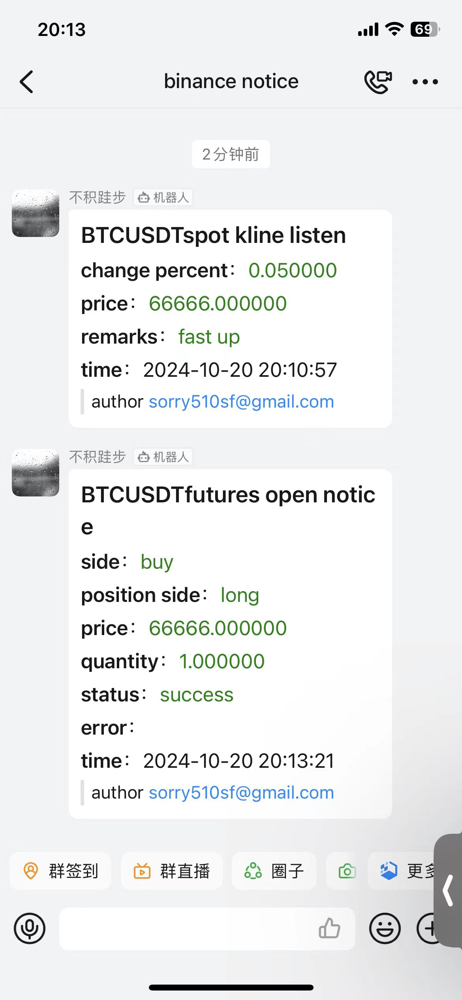
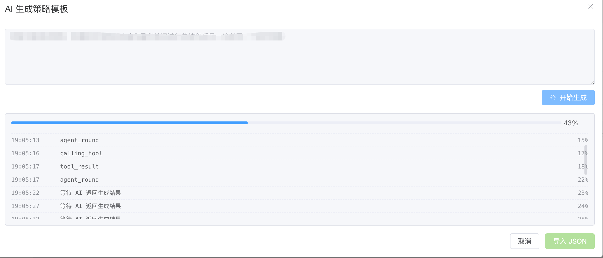
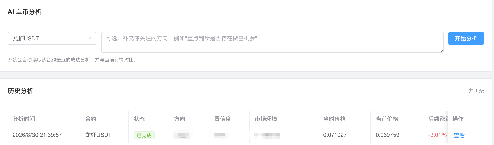
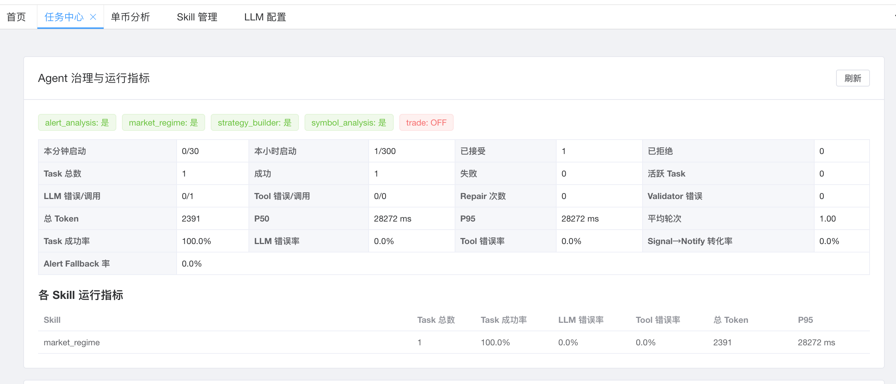
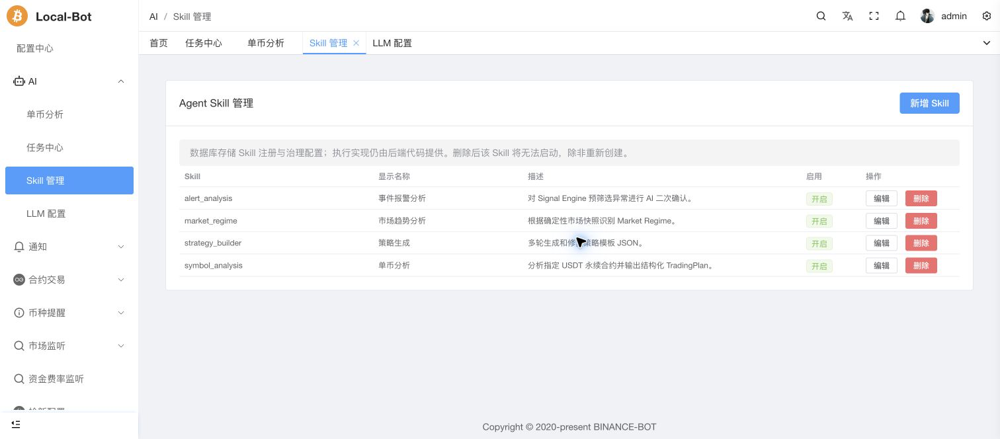
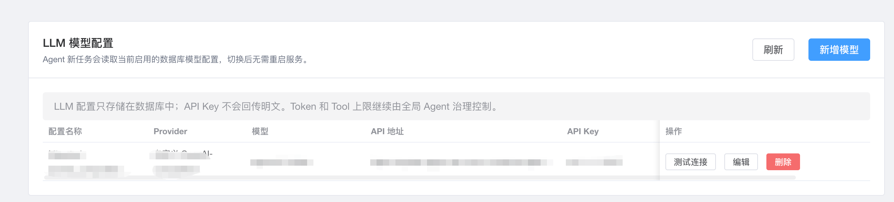
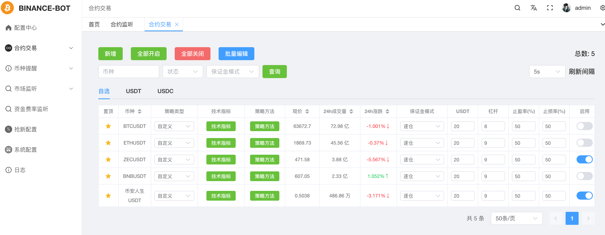

<p align="center">
    <a href="./README.md">简体中文</a>
    ·
    <a href="./README.EN.md">English </a>
</p>

# Binance-trade-bot

## Update database

Database schema updates are handled by a dedicated command instead of the normal application startup path. After configuring the database connection in `conf/app.conf`, run:

```bash
./go_binance_futures sync db
```

The command performs the database work required by the current binary:

1. Synchronizes the database schema from the registered Models, creating missing tables and columns.
2. Initializes base data such as `config` and the default strategy templates for a new database.
3. Runs version migrations from `command/sql/version/*.sql` according to the database version.
4. Updates the stored database version and prints progress logs.
5. Exits immediately after completion; it does not start the Web server, WebSocket connections, Scheduler, trading services, or Agents.

Run `sync db` in these situations:

- **First deployment:** configure the database, run `./go_binance_futures sync db`, then start the application normally.
- **Application upgrade:** after replacing the binary with a newer release, run `./go_binance_futures sync db` before starting the new version.
- **Database restore or migration:** after copying an existing SQLite database, restoring a MySQL/PostgreSQL backup, or switching databases, run the command before normal startup.
- **Startup reports an uninitialized or outdated database:** stop the service, run the command, and restart only after it succeeds.

Normal startup:

```bash
./go_binance_futures
```

Normal startup **does not automatically synchronize the schema or run database version migrations**. If the database has not been initialized or its version is older than the current binary requires, the application will instruct you to run `go_binance_futures sync db`. Back up the database before production upgrades and preferably run the sync command while the service is stopped.

## peculiarity

## Pusher
> dingding, slack

- dingding


- slack


## custom strategy

### ai strategy create


### desc

In the new UI, maintain indicators and strategy methods under **Futures Trade → Strategy Templates** (`合约交易 → 策略模板`), then assign a global or custom strategy to each symbol under **Futures Trade → Futures Trade** (`合约交易 → 合约交易`).

<a href="./STRATEGY.md">custom strategy details</a>

# DISCLAIMER

```
I am not responsible for anything done with this bot.
You use it at your own risk.
There are no warranties or guarantees expressed or implied.
You assume all responsibility and liability.
```


# Features <!-- omit in toc -->

## New Web UI

Open `http://<server-ip>:<web.port>/zmkm/index.html`. The login username and password come from `web.username` and `web.password` in `conf/app.conf`.

| Menu | Pages and purpose |
| --- | --- |
| Configuration Center (`配置中心`) | Non-AI global settings for futures trading, WebSocket, new-coin rush, price alerts, market monitoring, funding-rate monitoring, notifications, debug push, and external links |
| AI → Chat (`AI → 对话`) | Unified Agent chat entry; choose chat-enabled Native/Portable Skills and optionally select a real futures Symbol from the contract list so natural-language aliases cannot select the wrong market |
| AI → Symbol Analysis (`AI → 单币分析`) | Select a real USDT perpetual contract, start structured AI analysis, and review historical TradingPlans, direction, confidence, market regime, and subsequent price movement |
| AI → Model Configuration (`AI → 模型配置`) | Add, edit, test, and switch database-backed LLM configurations; new tasks use the current model without a restart |
| AI → Skill Management (`AI → Skill 管理`) | Manage Native and Portable Skills in separate tabs with search, pagination, enable/disable, and an independent chat-availability switch |
| AI → MCP Management (`AI → MCP 管理`) | Connect and govern third-party HTTP MCP Servers, including Tools, Resources, Prompts, authentication/OAuth, and per-Skill permissions |
| AI → Memory Management (`AI → Memory 管理`) | Inspect and maintain long-term Agent Memory, Scope, TTL, and status |
| AI → Workflows (`AI → 业务 Workflow`) | Run market scan, strategy review, strategy experiments, alert triage, and daily market brief workflows and inspect parent/child tasks |
| AI → Controlled Trading (`AI → 受控交易`) | Convert a successful symbol analysis into a Trade Proposal, run deterministic risk checks, require human approval, re-check risk before execution, submit through the controlled Binance path, and retain audit history |
| AI → Task Center (`AI → 任务中心`) | View Agent governance, Scheduler state, runtime metrics, and Agent Task history |
| AI → Observability (`AI → 可观测性`) | Inspect long-term traces, model/Tool/Skill metrics, latency, token use, errors, and change history |
| AI → Alert Pipeline History (`AI → 报警链路历史`) | Trace FastMove/liquidation Signals from event processing through AI analysis/triage to notification or fallback |
| AI → AI Configuration (`AI → AI 配置`) | Central configuration for AI alerts, AI Schedulers, global Agent budgets/governance, and controlled-trading Risk Policy |
| Futures Trade → Futures Trade (`合约交易 → 合约交易`) | Browse `Favorites`, `USDT`, and `USDC` symbols; add, search, batch-edit, enable all, or disable all symbol configurations |
| Futures Trade → Futures Orders (`合约交易 → 合约订单`) | Search real futures order history by symbol and time range |
| Futures Trade → Futures Account (`合约交易 → 合约账户`) | View Binance futures assets, positions, and open orders |
| Futures Trade → Local Futures Account (`合约交易 → 本地合约账户`) | View assets, positions, and orders recorded locally by the application |
| Futures Trade → Strategy Templates (`合约交易 → 策略模板`) | Create and maintain indicator and strategy-method templates |
| Futures Trade → Test Results (`合约交易 → 测试结果`) | Search simulated-trading results by symbol and time range |
| Coin Alerts → Spot/Futures Alerts (`币种提醒 → 现货提醒 / 合约提醒`) | Configure target-price alerts and optional automatic trades |
| Market Monitoring → Spot/Futures Monitoring (`市场监听 → 现货监听 / 合约监听`) | Configure K-line, threshold, indicator, and custom-strategy monitoring |
| Funding Rate Monitoring (`资金费率监听`) | View funding rates and configure automatic trading |
| New-Coin Rush (`抢新配置`) | Configure spot, mining-token, and futures launch trades |
| System Configuration (`系统配置`) | Edit `conf/app.conf` online and access Save, Restart Service, and Stop Service actions |
| Logs (`日志`) | Display the service logs returned by `web.commend_log` |

### New UI screenshots

These screenshots use the current UI. Pages that may contain balances, orders, configuration secrets, or log text show only a safe area.

#### Configuration Center


#### AI - Symbol Analysis


#### AI - Task Center


#### AI - Skill Management


#### AI - Model Configuration


#### Futures Trade


#### Futures Orders


#### Futures Account


#### Local Futures Account


#### Strategy Templates


#### Test Results


#### Spot Alerts


#### Futures Alerts


#### Spot Monitoring


#### Futures Monitoring


#### Funding Rate Monitoring


#### New-Coin Rush


#### Notification Configuration


#### System Configuration


#### Logs


## AI features

### Chat

**AI → Chat** is the unified human entry point for the Agent platform. Select any Skill that is allowed in chat. For symbol analysis, the composer includes a searchable selector backed by the application's real futures contract list; the selected Symbol is sent explicitly and takes precedence over text parsing, so Chinese names, aliases, or free-form wording cannot accidentally select another market. Without a Symbol, the Skill can still handle ordinary conversation, and only explicit follow-up wording reuses the previous Symbol.

### Symbol Analysis

Select a real USDT perpetual Symbol and optionally add an analysis focus. The application runs the `symbol_analysis` Skill with market data, current market regime, and the latest successful comparison context, then returns a structured `TradingPlan`. History shows status, direction, confidence, market regime, analysis-time price, current price, later movement, and summary.

### Model Configuration

LLM configurations are database-backed. The page supports provider templates and custom providers, configuration name, API endpoint, API key, model, request timeout, Temperature, connection testing, and switching the active model. New Agent tasks use the active configuration without restarting the service. API keys are never returned in plaintext.

### Skill Management

Skill registration and governance settings are stored in the database. Native and Portable Skills are shown in separate tabs with search and pagination. The page supports create/edit, enable/disable, deletion, and a separate **Chat Enabled** switch. `enabled` controls whether a Skill can run; `chat_enabled` only controls whether it is exposed to chat. Portable `allowed-tools` entries are permission requests and cannot self-grant high-risk or trading access.

### MCP Management

The application can act as an MCP Client for third-party standard HTTP MCP Servers and bring remote Tools, Resources, and Prompts into the same Runtime, Permission, Trace, and Context system. The UI supports connection tests, Catalog refresh, authentication/OAuth, and per-Skill grants. External capabilities identified as real trading actions are forced into the high-risk trade class and kept disabled so they cannot bypass controlled execution.

### Memory Management

Long-term Memory is persisted separately from Conversations and Tasks. The page exposes content, source, Scope, TTL, status, and update time. Memory contributes context only; it does not gain Tool or trading privileges.

### Business Workflows

Business Workflows reuse the existing Agent Runtime instead of creating a second Agent stack:

- `market_scan`: a deterministic Scanner narrows the market first, then the Agent analyzes a small candidate set and returns opportunities.
- `strategy_review`: reviews a strategy template using existing test results, post-fee performance, and the current market regime; it proposes changes but never edits the formal template directly.
- `strategy_experiment`: the Agent proposes a candidate, deterministic expression validation and fixed-scenario tests run, and the Agent summarizes the result; experiments never overwrite a formal strategy.
- `alert_triage`: when AI is enabled, related same-symbol Signals arriving close together can be grouped into an Incident to reduce duplicate notifications; AI-off/failure paths keep deterministic fallback behavior.
- `daily_market_brief`: aggregates market regime, Scanner results, and important Signals into a fixed-schema brief; its Scheduler is disabled by default.

### Controlled Trading

Controlled trading does **not** expose a direct trading Tool to the LLM. Real execution follows this fixed path:

`successful symbol_analysis → Trade Proposal → deterministic Risk Engine → human approval → risk re-check → Execution Service → Binance → Audit`.

- Real AI execution is disabled by default and the allowed-symbol list starts empty.
- A Proposal can only originate from a successful structured symbol analysis; the LLM does not choose the final quantity.
- The Risk Engine checks the allowlist, direction, current market regime and regime drift, price freshness, Entry Zone, Stop Loss, estimated slippage, existing positions/open orders, duplicates, cooldown, leverage, per-trade risk, notional size, total exposure, and the Kill Switch.
- Final quantity is computed deterministically from maximum risk, stop distance, maximum notional, and the exchange StepSize.
- Risk is run again before real execution, and the Kill Switch is read again immediately before broker submission.
- A unique `client_order_id` makes submission idempotent. Ambiguous network results are never automatically resubmitted; they can only be reconciled by that ID.
- Proposal, Risk, approval/rejection, execution, and reconciliation actions are audited.
- Current controlled execution submits an opening `MARKET` order. TradingPlan take-profit/stop-loss values are used by Risk and approval but do not yet automatically create Binance protective TP/SL orders.

### AI Configuration

All AI runtime configuration is centralized under **AI → AI Configuration**, including:

- Alert Pipeline / AI analysis switches, minimum severity, cooldown, concurrency, and per-minute limits.
- Market-regime update and daily-market-brief Schedulers.
- Global Agent admission limits plus Token and Tool-call budgets.
- Controlled-trading Kill Switch, Symbol allowlist, max per-trade risk/notional, total exposure, leverage, price freshness, slippage, cooldown, and Proposal TTL.

These settings have been moved out of **Configuration Center**, which now contains only non-AI trading, market-monitoring, alert, and system runtime settings.

### Task Center, Observability, and Alert History

- **Task Center:** governance state, direct Runtime trade permission vs controlled execution state, Scheduler jobs, Task history, model identity, tokens, and task details.
- **Observability:** long-term traces and per-Skill/model/Tool metrics including errors, latency, tokens, and change history.
- **Alert Pipeline History:** the end-to-end Signal path from Event Bus and Signal Engine through AI analysis/triage to Notification or deterministic fallback.

## futures-trade

The **Futures Trade → Futures Trade** page supports per-symbol settings for strategy type, indicators, strategy methods, margin mode, USDT amount, leverage, take-profit rate, stop-loss rate, and enabled status.

### Enabling futures trading

1. Under **Configuration Center → Futures Trade** (`配置中心 → 合约交易`), enable the futures master switch and `WebSocket`.
2. Enable `Allow Long` and/or `Allow Short`, then configure the global strategies, position limits, and order type.
3. Open **Futures Trade → Futures Trade** and verify the target symbol's parameters and enabled status.

### Global settings

- **Fast-movement alerts:** configure the movement threshold, recovery threshold, cooldown, and monitoring windows. Review Signal analysis, triage, notifications, and fallback under **AI → Alert Pipeline History**.
- **Position profit sign-change notification:** sends a notification when a position changes between profit and loss. Enabling it for many positions or symbols increases API traffic.
- **Allow Long / Allow Short:** direction-level master switches; disabled directions will not open even when a strategy matches.
- **Trading Strategy / Coin Selection Strategy:** used when a symbol's strategy type is `global`; custom symbols use their own configuration.
- **Maximum Positions / Maximum Losing Positions:** prevent new automatic positions after a limit is reached. Automatic scaling can adjust the losing-position limit after consecutive wins or losses.
- **Market Trend:** select it manually or enable automatic market-trend updates for strategy evaluation.
- **Excluded Symbols:** symbols selected in the UI are excluded from automatic trading. Add existing manual positions here if the bot must not manage them.
- **Order Type:** `LIMIT` places a limit order; `MARKET` executes a market order.

## simulated custom-strategy trading (no backtesting)

Enable `WebSocket` and `Test Strategy` under **Configuration Center → Futures Trade**. Simulation follows the same strategies and limits as real automatic trading but does not operate the real futures account. Open the result from the `View Test Results` button or **Futures Trade → Test Results**.

When the `Test Auto-Conversion Count Limit` is non-zero, consecutive simulated wins can switch to real trading; consecutive real-trading losses can switch back to test mode.

## futures-trade-order

- **Futures Orders:** automatic-trading order history. Profit is estimated from order data and may differ slightly from Binance's final result.
- **Futures Account:** assets, positions, and open orders returned by Binance.
- **Local Futures Account:** the application's local account state, useful for comparing local data with exchange data.

## strategy-templates

Create and maintain templates under **Futures Trade → Strategy Templates**. A template contains indicators and strategy methods and can be reused by futures symbols and monitoring rules. See [Custom Strategy Details](./STRATEGY.md) for syntax.

## new-coin-rush

- spot rush buy
- mining rush sell
- futures rush long
- futures rush short

First enable the corresponding switch under **Configuration Center → New-Coin Rush**, then add the symbol rule on the **New-Coin Rush** page.

## coin-notice

### spot-notice

- alarm notification for reaching the preset price
- automatic buying or selling

### futures-notice

- alarm notification for reaching the preset price
- optional automatic trading with margin mode, USDT, leverage, take-profit price, and stop-loss price

Enable the master switch under **Configuration Center → Coin Alerts**, then maintain rules under **Coin Alerts → Spot Alerts** or **Futures Alerts**.

## market-listen

### spot-listen

- K-line change monitoring
- configurable threshold, notification interval, and enabled status

### futures-listen

- K-line and indicator monitoring
- custom strategy

Enable the master switch under **Configuration Center → Market Monitoring**, then add rules under **Spot Monitoring** or **Futures Monitoring**.

## funding-rate

- funding rate search and history
- funding rate change listen

Enable the master switch under **Configuration Center → Funding Rate Monitoring**, then query and configure symbols on the **Funding Rate Monitoring** page.

## system-config

- **Configuration Center:** changes non-AI database-backed trading, monitoring, and alert runtime settings.
- **AI → AI Configuration:** centralizes AI alerts, Schedulers, global Agent budgets, and controlled-trading Risk Policy.
- **System Configuration:** edits `conf/app.conf` online. After `Save`, startup-time settings still require `Restart Service` or a manual application restart.
- **Logs:** displays output from the command configured in `web.commend_log`.

The System Configuration page contains sensitive values such as API keys, database passwords, and notification tokens. Never include it in screenshots, issues, or Git commits.

## important
- The network must be located outside the mainland (as the Binance interface cannot be accessed normally in mainland China). The proxy configuration for Binance API has been added (websocket has no proxy configuration due to component usage issues, and is only used to update the latest contract currency prices in the background). If there are available proxies, they can also be used normally
-Apply for api_key address: [Binance API Management Page]（ https://www.binance.com/cn/usercenter/settings/api-management )
- If the account already has futures positions, select symbols that the bot must not manage under **Configuration Center → Futures Trade → Excluded Symbols**. Otherwise, the bot may close them according to its strategy
- After modifying `conf/app.conf`, restart the application before expecting startup-time settings to take effect
-Please ensure that your account has sufficient USDT, otherwise placing an order will result in an error
- Do not exceed 20 notifications within 1 minute of DingTalk push, otherwise the IP address will be blocked for a period of time and the push will not be successful
-Adjusting too many parameters (such as using multiple combinations of functions under the same IP) may cause the Binance API request frequency to exceed the limit and disable the IP for a period of time

## how to use
> in https://github.com/sorry510/go_binance_futures/releases page download or use `golang` compile

### FAQ (new UI)

1. **Where do I enable automatic trading?** Open **Configuration Center → Futures Trade** and verify the futures master switch, `WebSocket`, and `Allow Long/Allow Short`. Then verify the symbol's enabled status under **Futures Trade → Futures Trade**.
2. **Where can I view simulated trades?** Enable `Test Strategy`, then use `View Test Results` or open **Futures Trade → Test Results**.
3. **Why did a configuration change not take effect?** Configuration Center updates runtime settings. System Configuration edits `conf/app.conf`; after `Save`, startup-time settings still require an application restart.
4. **Why are futures prices delayed?** Prices are updated through WebSocket. Check the `WebSocket` switch, network quality, and proxy stability.
5. **Why can the account not open a position?** Check direction switches, maximum-position limits, maximum losing positions, excluded symbols, symbol enabled status, and available USDT. Binance may also restrict some IP regions.
6. **Why is the UI slow?** For larger datasets, use MySQL; SQLite is better suited to smaller deployments.
7. **What should I do after an API rate-limit error?** Reduce enabled symbols, monitoring rules, and high-frequency notifications, then wait for Binance's restriction to clear.
8. **Where are AI alert, Scheduler, and budget settings?** Open **AI → AI Configuration**; these settings are no longer in Configuration Center.
9. **Can the AI place a real order directly?** No. Controlled execution is disabled by default and requires a Proposal, deterministic Risk checks, human approval, and a final Risk re-check.
10. **Where can I view service logs?** Open **Logs**. It runs the command configured in `web.commend_log`.

### edit config

```
cp conf/app.conf.example conf/app.conf
```

#### database config

##### use sqlite

- app.conf
```
[database]
driver = "sqlite"
path = "./db/coin.db?_journal_mode=WAL&_busy_timeout=5000"
```

##### use mysql

```
[database]
driver = "mysql"
username = ""
password = ""
host= ""
port= ""
dbname = ""
```

### how to run
> !!!Please note that after modifying the `app.conf` configuration, the program must be restarted, otherwise the configuration will not take effect!!!

For a first deployment, application upgrade, or restored database, synchronize the database first:

```bash
./go_binance_futures sync db
```

After the command completes successfully and exits, start the service normally:

```bash
./go_binance_futures
```

Normal startup does not modify the database schema or run database version migrations automatically.

### web page

- Server URL: `http://<server-ip>:<web.port>/zmkm/index.html`
- Local development URL: `http://localhost:3333/zmkm/index.html`
- Login credentials: `web.username` and `web.password` in `conf/app.conf`
- After login, the UI opens **Configuration Center**. Use the left navigation menu; there is no need to manually build `#/...` routes

### Trading Strategy
> Refer to the `feature/strategy` folder and [Custom Strategy Details](./STRATEGY.md)

### Common actions in the new UI

- **Futures Trade → Enable All / Disable All:** batch-updates the enabled status of the current symbol list. Verify the active filter first.
- **Futures Trade → Batch Edit:** changes settings for multiple symbols.
- **System Configuration → Save:** saves the `conf/app.conf` content shown in the editor.
- **System Configuration → Restart Service:** runs `web.commend_start`; configure this command in `conf/app.conf` first.
- **System Configuration → Stop Service:** runs `web.commend_stop`; configure this command in `conf/app.conf` first.
- **Logs:** runs `web.commend_log` and displays its output.

### new coin rush config

#### spot rush buy

| coin  |  trade_type | coin_type  | usdt  | step_size  | enable  |
| ------------ | ------------ | ------------ | ------------ | ------------ | ------------ |
| ABCUSDT  | buy  | spot  | 10  |0.1(if you don't know, please fill in 0)   | open   |

#### spot mining rush sell
> ps:Binance has a minimum transaction limit, and if the quantity is too small (such as 5 USDT), it cannot be conducted

| coin  |  trade_type | coin_type  | step_size  | amount  | enable  |
| ------------ | ------------ | ------------ | ------------ | ------------ | ------------ |
| ABCUSDT  | sell  | spot  | 0.1(if you don't know, please fill in 0)   | 80(Quantity of mining income) | open  |

#### futures rush buy long

| coin  |  trade_type | coin_type  | margin_type | usdt|  leverage | step_size  |  enable  |
| ------------ | ------------ | ------------ | ------------ | ------------ | ------------ |------------ | ------------ |
| ABCUSDT  | buy_long  | futures  | ISOLATED or CROSSED| 10|3 | 0.1(if you don't know, please fill in 0)  | open   |

#### futures rush buy short
| coin  |  trade_type | coin_type  |margin_type| usdt|  leverage | step_size  |  enable  |
| ------------ | ------------ | ------------ | ------------ | ------------ | ------------ |------------ | ------------ |
| ABCUSDT   | buy_short  | futures  | ISOLATED or CROSSED | 10|3 | 0.1(if you don't know, please fill in 0)   | open   |

## donate

### qrcode


#### bsc-usdt

```
0x170197328b6e73597bc29a1b059f29d4e111e1e8
```


## how to develop
>install golang

## technology function
>futures/strategy/line/technology.go

## config file

```
cp ./conf/app.conf.example app.conf
```

### install bee
> Remember to add `GOPAT/bin` to the environment variable `PATH`, otherwise the `bee` command cannot be used globally
> Use `go env GOPATH` to view the `GOPATH` path

```
go install github.com/beego/bee/v2@latest
```

### Install dependencies

```
go mod tidy
```

### how to run
> go to http://localhost:3333/zmkm/index.html

```
bee run
```

### pack

#### pack to `windows`

```
bee pack -be GOOS=windows
```

## web ui
> https://github.com/sorry510/binance_bot_ui
