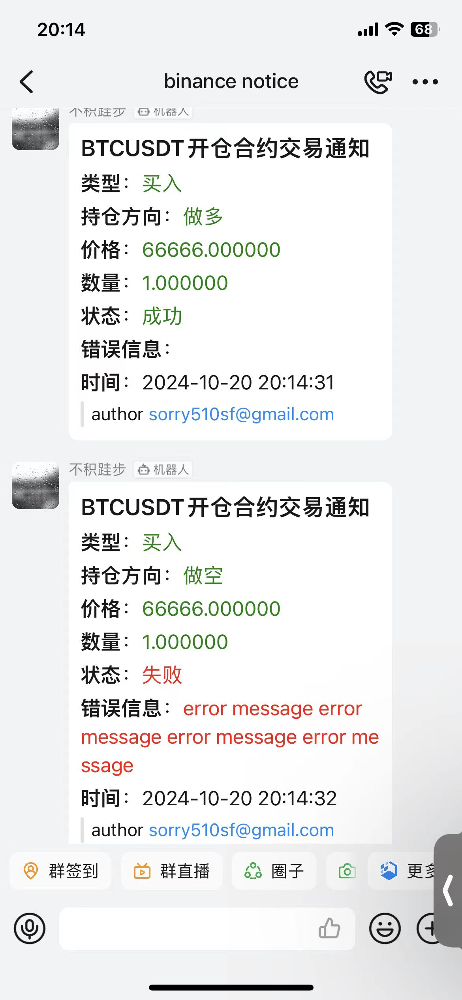
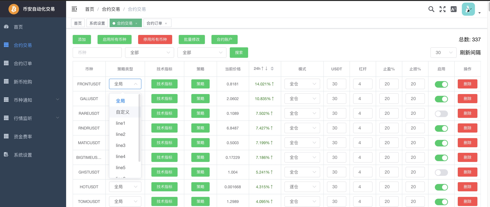
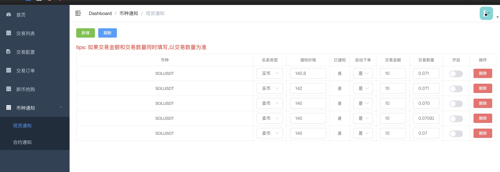
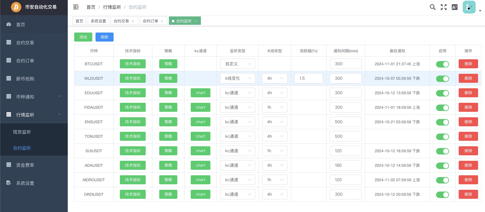
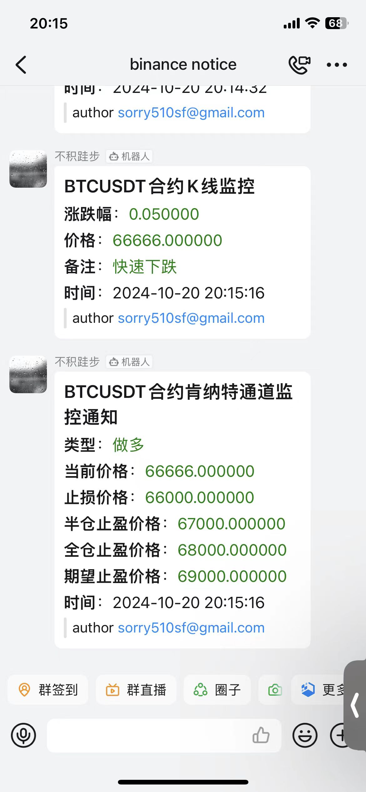
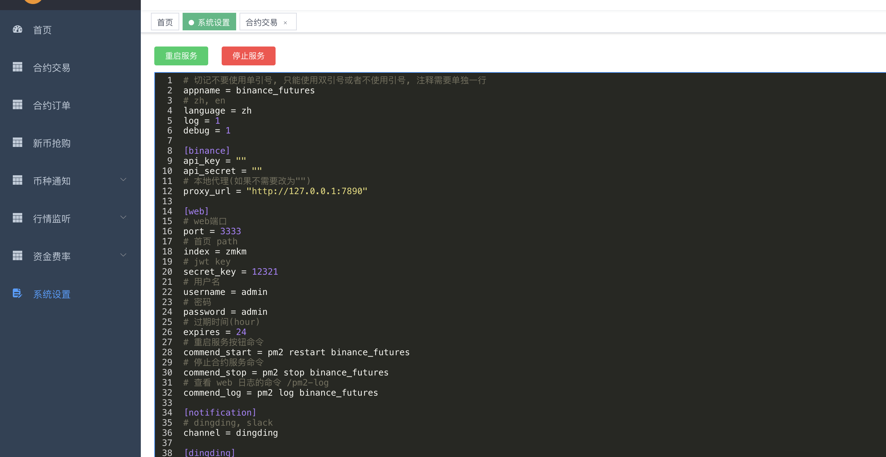

<p align="center">
    <a href="./README.md">简体中文</a>
    ·
    <a href="./README.EN.md">English </a>
</p>

# 币安交易机器人

## 数据库更新
> 如果是第一次使用程序，配置好数据库之后，直接运行即可(会自动生成相应的数据表)，如果已经使用了一段时间，下载新版本程序后，可以把旧数据库文件(适用于 sqlite 驱动)直接放到 `db` 目录下，然后运行程序即可

## 特色

## 实时推送
> dingding, slack

- 钉钉


- slack


## 自定义交易策略
> 
> 
> 

<a href="./STRATEGY.CN.md">自定义详情</a>

# 免责申明
>！！！本项目不构成任何投资建议，投资者应独立决策并自行承担风险！！！

# 功能

# Features <!-- omit in toc -->

- [合约交易](#合约交易)
- [合约自定义策略的模拟交易](#合约自定义策略的模拟交易)
- [合约订单](#合约订单)
- [新币抢购](#新币抢购)
- [币种通知](#币种通知)
    - [现货通知](#现货通知)
    - [合约通知](合约通知)
- [行情监听](#行情监听)
    - [现货监听](#现货监听)
    - [合约监听](合约监听)
- [资金费率](#资金费率)
- [系统设置](#系统设置)

## 合约交易
- 每个币种的单独配置(策略，数量，止盈，止损)



### 开启方法
> 首页打开 合约交易 开关和 下面的 websocket 开关, 我将对之后的子配置项设置进行说明

### 配置项说明
#### 仓位收益正负转换通知
> 当你某个仓位的收益发生正和负转换时，发送通知(如果你的仓位和允许的量化交易币种数量过多不建议打开，容易超出api限制)

#### 允许做多 和 允许做空
> 总开关, 关闭情况下即使符合开仓策略也不会开仓

#### 交易策略 和 选币策略
> 如果某个合约币种的测试类型是 全局 时，这里的设置生效

#### 最大持仓数量
> 当自动化仓位超出这个限制时，不会再自动化开仓，即使符合开仓策略

#### 最大持仓亏损数量
> 当前仓位亏损数量超出这个限制时，不会再自动化开仓，即使符合开仓策略

#### 排除自动交易的币
> 选择的币种不会参与自动化交易

#### 自动下单类型
> limit 挂单，market 市价吃单

## 合约自定义策略的模拟盘测试(无回测功能)
### 开启方法
> 首页合约交易以下开关打开: websocket, 测试策略，之后就会和真实的自动化合约交易一样进行自动化测试交易，点击首页 测试策略结果 即可查看所有的模拟开仓和平仓的测试交易，和真实的合约交易类似，遵循真实自动化交易的所有条件限制，只不过开仓和平仓不会使用你的真实合约账户

## 合约订单
- 合约自动交易的订单历史(收益是根据下单预估的，没有查询币安的接口，与实际收益会有稍微不同)


## 新币抢购
- 币币抢买
- 币币挖矿抢卖
- 合约抢买做多
- 合约抢买做空


## 币种通知
### 现货通知
- 达到预设价格报警通知
- 自动买入或卖出


### 合约通知
- 达到预设价格报警通知
- 自动买入并自动挂止盈止损单


## 行情监听

### 现货监听
- k线变化监听


### 合约监听
- k线变化监听
- 肯纳特通道信号监听
- 自定义策略




## 资金费率
- 资金费率查询和历史记录
- 资金费率变化监听


## 系统设置
- 交易的基本相关的配置(conf)


## 使用注意事项
- 网络必须处于大陆之外(因为币安接口大陆正常无法访问), 已添加币安 api 的代理配置(websocket 因为使用组件问题，暂无代理配置， websocket 只是用于后台更新合约币种最新价格)，如果有可用代理也可以正常使用
- 申请api_key地址: [币安API管理页面](https://www.binance.com/zh/usercenter/settings/api-management)
- 如果你的账号本身已经有合约仓位，请一定要在首页中配置排除自动交易的币(多个使用,号隔开), 排出掉你不想使用本程序自动交易的币，否则默认所有的仓位都会根据交易策略规则自动平仓
- !!!注意修改app.conf配置后必须重新启动程序，否则配置不会生效!!!
- 请保证账户有足够的 USDT，否则下单会报错
- 钉钉推送 1min 中内不要超过 20 条，否则会被封 ip 一段时间，无法推送成功
- 调整过大的参数(例如同一个 ip 下使用多种组合功能)可能会造成币安 api 请求频率超出限制，会禁用一段时间 ip

## 如何使用
> 在 https://github.com/sorry510/go_binance_futures/releases 页面下载最新对应操作系统的发布版解压后配置运行或者使用`golang`自行编译

### 修改配置文件
> 配置说明请参考 `app.conf.example` 中每一项的说明，复制修改文件名为 `app.conf`

```
cp conf/app.conf.example conf/app.conf
```

#### 数据库配置

##### 使用 sqlite

- app.conf
```
[database]
driver = "sqlite"
path = "./db/coin.db?_journal_mode=WAL&_busy_timeout=5000"
```

##### 使用 mysql (需要自行安装 mysql，性能更好)

```
[database]
driver = "mysql"
username = ""
password = ""
host= ""
port= ""
dbname = ""
```

### 程序运行
> !!!注意修改app.conf配置后必须重新启动程序，否则配置不会生效!!!

```
./go_binance_futures
```

### web 界面说明
>访问地址: http://ip:host/zmkm/index.html # ip 为部署服务器ip，port 为 app.conf 中 web.port
登录的账号密码为 app.conf 文件中的  web.username 和 web.password

### 交易策略
> 参考 `feature/strategy` 文件夹

### 交易列表按钮说明(非必需，用来修改配置后的重新启动)
#### 重启所有服务
> 对应的是 app.conf 中 web.commend_start 下的命令，需要自行配置

#### 停止合约服务
> 对应的是 app.conf 中 web.commend_stop 下的命令，需要自行配置

#### 开启所有
> 开启所有币种

#### 停用所有
> 停用所有币种

### 新币抢购配置说明

#### 币币抢买功能配置例子

| 币种  |  买卖类型 | 类型  | usdt  | 数量精度  | 开启  |
| ------------ | ------------ | ------------ | ------------ | ------------ | ------------ |
| ABCUSDT(切记带着USDT后缀)   | 买币  | 币币  | 10  |0.1(手动设定会减少一次api请求，不知道时设置为0会在上线时查询接口自动获取)   | 开启   |

#### 币币挖矿抢卖功能配置例子
> ps: 如果挖矿的总价值小于5usdt，不能进行交易

| 币种  |  买卖类型 | 类型  | 数量精度  | 数量 | 开启  |
| ------------ | ------------ | ------------ | ------------ | ------------ | ------------ |
| ABCUSDT(切记带着USDT后缀)   | 卖币  | 币币  | 0.1(手动设定会减少一次api请求，不知道时设置为0会在上线时查询接口自动获取)   | 80(挖矿所得数量) |开启   |

#### 合约抢买做多配置例子

| 币种  |  买卖类型 | 类型  |模式| usdt|  倍率| 数量精度  |  开启  |
| ------------ | ------------ | ------------ | ------------ | ------------ | ------------ |------------ | ------------ |
| ABCUSDT(切记带着USDT后缀)   | 买币  | 合约  | 逐仓或全仓| 10|3 |0.1(手动设定会减少一次api请求，不知道时设置为0会在上线时查询接口自动获取)  |开启   |

#### 合约抢买做空配置例子
| 币种  |  买卖类型 | 类型  |模式| usdt|  倍率| 数量精度  |  开启  |
| ------------ | ------------ | ------------ | ------------ | ------------ | ------------ |------------ | ------------ |
| ABCUSDT(切记带着USDT后缀)   | 卖币  | 合约  | 逐仓或全仓| 10|3 |0.1(手动设定会减少一次api请求，不知道时设置为0会在上线时查询接口自动获取)  |开启   |


## 交流群

### wx


### tg
https://t.me/+neEHA8VSgF1jMTg9


## 开发
>安装最新版 golang

## 配置文件

```
cp ./conf/app.conf.example app.conf
```

### 安装 bee
> 记得将`GOPATH/bin`添加到环境变量`PATH`，否则 `bee` 命令无法全局使用
> 使用 `go env GOPATH` 查看 `GOPATH` 路径

```
go install github.com/beego/bee/v2@latest
```

### 安装依赖
> 进入项目根目录下执行

```
go mod tidy
```

### 启动
> http://localhost:3333/zmkm/index.html

```
bee run
```

### 打包

#### 打包到`windows`平台
> 其它平台需要参考 bee 文档
> 此项目的 github 的 workflows 实现了 linux amd64 和 window amd64 下的编译打包

```
bee pack -be GOOS=windows
```

## web ui 开发
> https://github.com/sorry510/go_binance_futures_ui

### TODO

- [X] 完成新币抢购功能
- [X] 完成挖矿新币抛售功能
- [X] 添加独立的币种配置收益率
- [X] 添加一键修改所有币种的配置
- [X] 系统首页显示(那些服务开启和关闭)
- [X] 监听币种的价格突变情况，报警通知
- [X] 学习蜡烛图结合其它数据，报警通知
- [X] 添加新的自动交易策略
- [X] 批量配置自定义策略，使用模板方式导入，增加一个模板页面(可以导入策略模板)
- [X] 更新代码提示功能
- [X] 将配置从 `conf` 缩减，改为可视化配置实时生效
- [X] 数据库更新方式，第一次自动生成 db 文件，如果存在数据库，就根据版本号进行更新语句更新
- [X] 现货和合约添加 tab，添加 usdt 之外的交易对
- [X] 抢购添加手动设定价格挂单的功能，不设定才采用市价抢单
- [ ] api 重构，添加一层适配器用来统一支持其它交易所的接口
- [ ] 替换现有的币安 sdk 换用官方的
- [ ] 添加币本位合约
- [ ] 接入币安的订单接口(优点:精确化操控合约的每一次开仓，不再对当前仓位的合约全部平仓, 缺点:手动操作的合约，无法自动根据策略完成平仓)
- [ ] 添加定时自动交易(现货买入和x倍合约等值对冲，吃资金费用)
- [ ] 监控资金流入流出，报警通知


