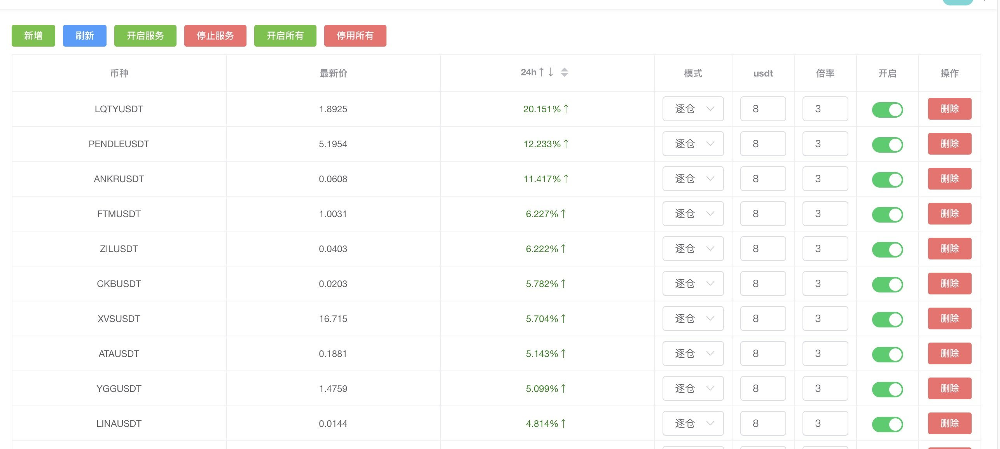
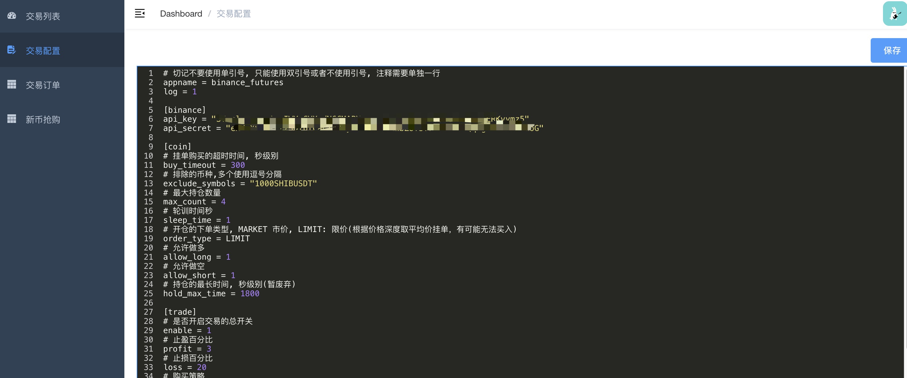
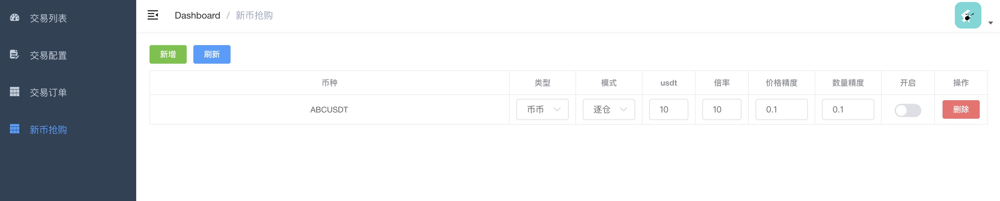

## 币安合约自动交易
- 自动交易
- 交易策略看 `feature/strategy` 目录源码
- 支持每个币种的单独配置(合约模式,购买金额,合约倍率,是否开启)

### 免责申明
>！！！本项目不构成任何投资建议，投资者应独立决策并自行承担风险！！！

## image





## dingding push


### 说明
> 申请api_key地址: [币安API管理页面](https://www.binance.com/cn/usercenter/settings/api-management)

### 使用前注意事项
> 如果你的账号本身已经有合约仓位，请一定要在 `app.conf` 文件中配 `excludeSymbols`, 排出掉你不想使用本程序自动交易的币，否则默认所有的仓位都会根据交易策略规则自动平仓

## 使用
> 在 https://github.com/sorry510/go_binance_futures/releases 页面下载最新对应操作系统的发布版解压后配置运行或者使用`golang`自行编译

#### 修改配置文件
> 配置说明请参考 `app.conf.example` 中每一项的说明

```
cp conf/app.conf.example conf/app.conf
```

#### 运行文件
> !!!注意修改app.conf配置后必须重新启动程序，否则配置不会生效!!!

```
./go_binance_futures
```

#### 交易策略
> 参考 `feature/strategy` 文件夹

#### web 说明
>访问地址: http://ip:host/zmkm/index.html # ip 为部署服务器ip，port 为 app.conf 中 web.port
登录的账号密码为 app.conf 文件中的  web.username 和 web.password

##### 交易列表按钮说明(非必需，用来修改配置后的重新启动)
###### 重启所有服务
> 对应的是 app.conf 中 web.commend_start 下的命令，需要自行配置

###### 停止合约服务
> 对应的是 app.conf 中 web.commend_stop 下的命令，需要自行配置

###### 开启所有
> 开启所有币种

###### 停用所有
> 停用所有币种


### 注意事项
- !!!注意修改app.conf配置后必须重新启动程序，否则配置不会生效!!!
- 由于币安交易所的 api 在大陆无法访问，请使用国外的服务器
- 请保证账户有足够的 USDT
- 钉钉推送 1min 中内不要超过 20 条，否则会被封 ip
- 调整过大的参数可能会造成币安 api 请求频率超出限制，会禁用一段时间ip

## 开发
>安装最新版 golang

### 安装bee
> 记得将`GOPATH/bin`添加到环境变量`PATH`，否则 `bee` 命令无法全局使用
> 使用 `go env GOPATH` 查看 `GOPATH` 路径

```
go install github.com/beego/bee/v2@latest
```

### 安装依赖
> 进入项目根目录下执行

```
go mod tidy
```

### 启动
> http://localhost:3333/zmkm/index.html

```
bee run
```

### 打包

#### 打包到`windows`平台

```
bee pack -be GOOS=windows
```

### TODO

- [X] 完成新币抢购功能
- [X] 添加独立的币种配置收益率
- [X] 添加一键修改所有币种的配置
- [ ] 添加新的交易策略