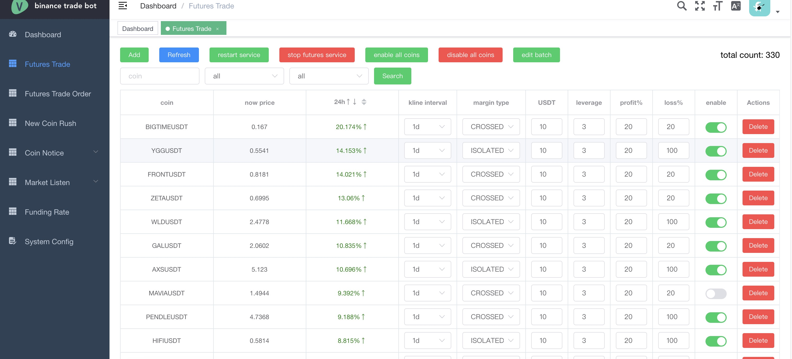
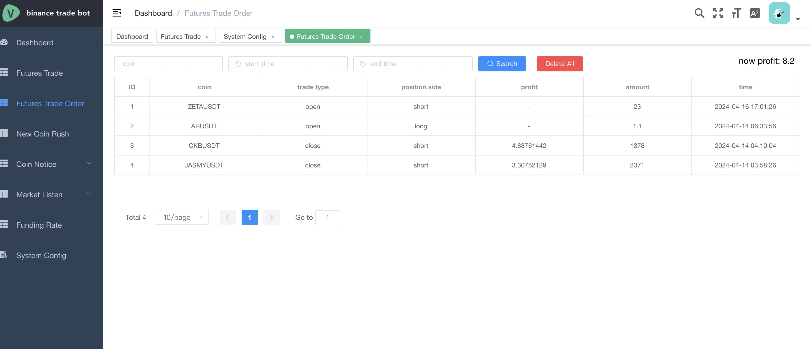
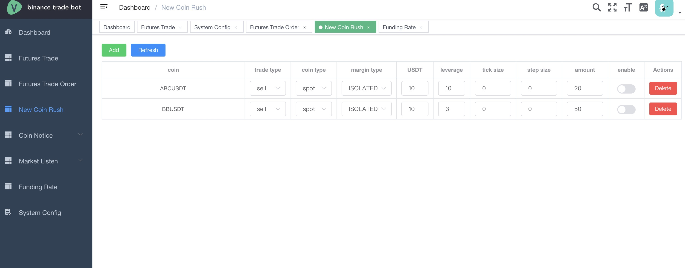
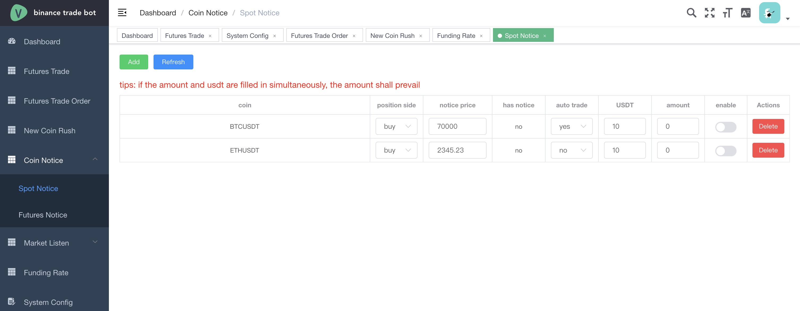
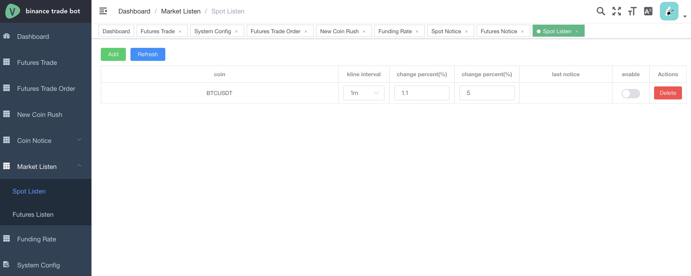
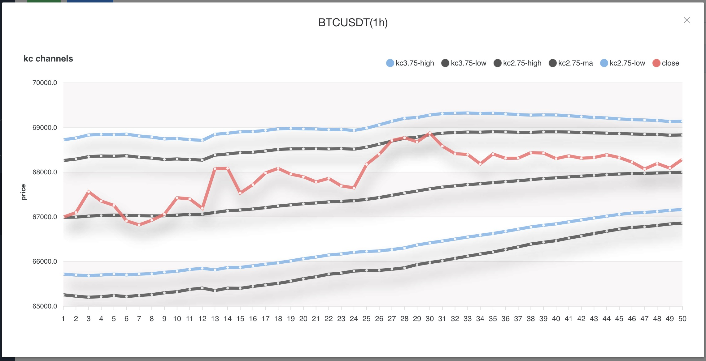
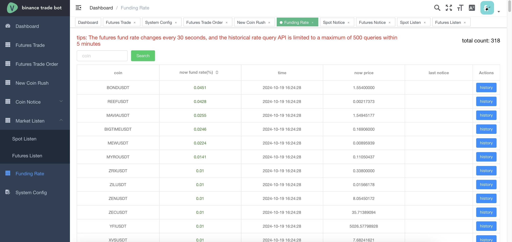
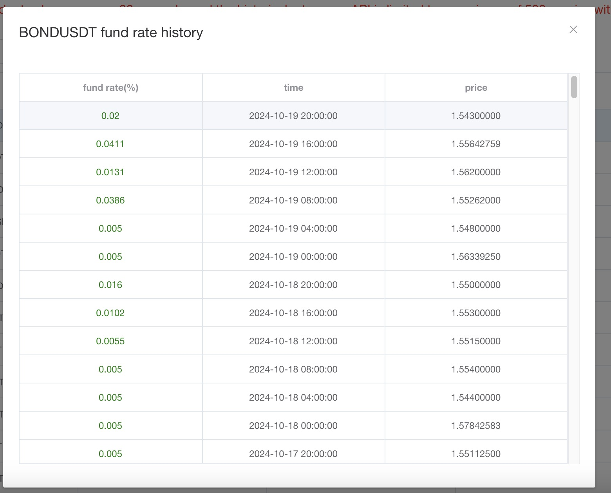
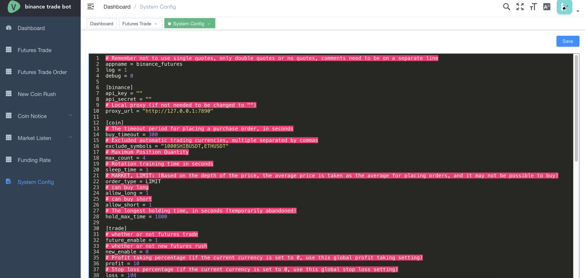

<p align="center">
    <a href="./README.md">English </a>
    ·
    <a href="./README.CN.md">简体中文</a>
</p>

# Binance-trade-bot

# DISCLAIMER

```
I am not responsible for anything done with this bot.
You use it at your own risk.
There are no warranties or guarantees expressed or implied.
You assume all responsibility and liability.
```

# Features <!-- omit in toc -->

- [Futures Trade](#futures-trade)
- [Futures Trade Order](#futures-trade-order)
- [New Coin Rush](#new-coin-rush)
- [Coin Notice](#coin-notice)
    - [Spot Notice](#spot-notice)
    - [Futures Notice](futures-notice)
- [Market Listen](#market-listen)
    - [Spot Listen](#spot-listen)
    - [Futures Listen](#futures-listen)
- [Funding Rate](#funding-rate)
- [System Config](#system-config)

## futures-trade
- Independent configuration for each coin



## futures-trade-order
- Order history (revenue is estimated based on orders placed, without a Binance query interface, and may differ slightly from actual revenue)


## new-coin-rush
- spot rush buy
- mining rush sell
- futures rush long
- futures rush short


## coin-notice
### spot-notice
- alarm notification for reaching the preset price
- automatic buying or selling


### futures-notice
- alarm notification for reaching the preset price
- automatic buying or selling


## market-listen

### spot-listen
- kline change listen


### futures-listen
- kline change listen
- kline keltner channels listen




## funding-rate
- funding rate search and history
- funding rate change listen



## system-config
- app.conf

```
# Remember not to use single quotes, only double quotes or no quotes, comments need to be on a separate line
appname = binance_futures
log = 1
debug = 0

[binance]
api_key = ""
api_secret = ""
# Local proxy (if not needed to be changed to "")
proxy_url = "http://127.0.0.1:7890"

[coin]
# The timeout period for placing a purchase order, in seconds
buy_timeout = 300
# Excluded automatic trading currencies, multiple separated by commas
exclude_symbols = "1000SHIBUSDT,ETHUSDT"
# Maximum Position Quantity
max_count = 4
# Rotation training time in seconds
sleep_time = 1
# MARKET, LIMIT: (Based on the depth of the price, the average price is taken as the average for placing orders, and it may not be possible to buy)
order_type = LIMIT
# can buy long
allow_long = 1
# can buy short
allow_short = 1
# The longest holding time, in seconds (temporarily abandoned)
hold_max_time = 1800

[trade]
# whether or not futures trade
future_enable = 1
# whether or not new futures rush
new_enable = 0
# Profit taking percentage (if the current currency is set to 0, use this global profit taking setting)
profit = 10
# Stop loss percentage (if the current currency is set to 0, use this global stop loss setting)
loss = 100
# Trading Strategy(line1~line7
strategy_trade = line7
# Coin selection strategy(coin1~coin5)
strategy_coin = coin5

[spot]
# whether or not new spot rush
new_enable = 0

[notice_coin]
# whether or not coin notice
enable = 0

[listen_coin]
# whether or not coin listen
enable = 0
# whether or not funding rate listen
funding_rate = 0

[web]
# web port
port = 3333
# index path
index = zmkm
# jwt key
secret_key = 12321
# username
username = admin
# password
password = admin
# restart command
commend_start = pm2 restart binance_futures
# stop command
commend_stop = pm2 stop binance_futures
# log command
commend_log = pm2 log binance_futures

[dingding]
# token
dingding_token = ""
# trigger keywords
dingding_word = "报警"

[external]
# external links
links = [{"url": "url1", "title": "title1"}]
```


## important
- The network must be located outside the mainland (as the Binance interface cannot be accessed normally in mainland China). The proxy configuration for Binance API has been added (websocket has no proxy configuration due to component usage issues, and is only used to update the latest contract currency prices in the background). If there are available proxies, they can also be used normally
-Apply for api_key address: [Binance API Management Page]（ https://www.binance.com/cn/usercenter/settings/api-management )
- If your account already has contract positions, please be sure to configure 'excludeSymbols' in the' app. conf 'file to exclude coins that you do not want to use this program for automatic trading. Otherwise, all positions will be automatically closed according to the trading strategy rules by default
- !!! Please note that after modifying the app.cnf configuration, the program must be restarted, otherwise the configuration will not take effect!!!
-Please ensure that your account has sufficient USDT, otherwise placing an order will result in an error
- Do not exceed 20 notifications within 1 minute of DingTalk push, otherwise the IP address will be blocked for a period of time and the push will not be successful
-Adjusting too many parameters (such as using multiple combinations of functions under the same IP) may cause the Binance API request frequency to exceed the limit and disable the IP for a period of time

## how to use
> in https://github.com/sorry510/go_binance_futures/releases page download or use `golang` compile

### edit config

```
cp conf/app.conf.example conf/app.conf
```

### how to run
> !!!Please note that after modifying the `app.conf` configuration, the program must be restarted, otherwise the configuration will not take effect!!!

```
./go_binance_futures
```

### web page
> access address: http://ip:host/zmkm/index.html# The IP is the deployment server IP, and the port is the web. port in app.cnf
The login account password is the `web.username` and `web.password` in the `app.conf` file

### Trading Strategy
> Refer to the 'futuress/rate' folder


### description of the futures-trade list button (optional, used for restarting after modifying the configuration)
#### service restart
> will run `web.commend_start`

#### service stop
> will run `web.commend_stop`

#### open all coin
> open all futures coin

#### close all coin
> close all futures coin

### new coin rush config

#### spot rush buy

| coin  |  trade_type | coin_type  | usdt  | step_size  | enable  |
| ------------ | ------------ | ------------ | ------------ | ------------ | ------------ |
| ABCUSDT  | buy  | spot  | 10  |0.1(if you don't know, please fill in 0)   | open   |

#### spot mining rush sell
> ps:Binance has a minimum transaction limit, and if the quantity is too small (such as 5 USDT), it cannot be conducted

| coin  |  trade_type | coin_type  | step_size  | amount  | enable  |
| ------------ | ------------ | ------------ | ------------ | ------------ | ------------ |
| ABCUSDT  | sell  | spot  | 0.1(if you don't know, please fill in 0)   | 80(Quantity of mining income) | open  |

#### futures rush buy long

| coin  |  trade_type | coin_type  | margin_type | usdt|  leverage | step_size  |  enable  |
| ------------ | ------------ | ------------ | ------------ | ------------ | ------------ |------------ | ------------ |
| ABCUSDT  | buy_long  | futures  | ISOLATED or CROSSED| 10|3 | 0.1(if you don't know, please fill in 0)  | open   |

#### 合约抢买做空配置例子
| coin  |  trade_type | coin_type  |margin_type| usdt|  leverage | step_size  |  enable  |
| ------------ | ------------ | ------------ | ------------ | ------------ | ------------ |------------ | ------------ |
| ABCUSDT   | buy_short  | futures  | ISOLATED or CROSSED | 10|3 | 0.1(if you don't know, please fill in 0)   | open   |


## how to develop
>install golang

## technology function
>futures/strategy/line/technology.go

## config file

```
cp ./conf/app.conf.example app.conf
```

### install bee
> Remember to add `GOPAT/bin` to the environment variable `PATH`, otherwise the `bee` command cannot be used globally
> Use `go env GOPATH` to view the `GOPATH` path

```
go install github.com/beego/bee/v2@latest
```

### Install dependencies

```
go mod tidy
```

### how to run
> go to http://localhost:3333/zmkm/index.html

```
bee run
```

### pack

#### pack to `windows`

```
bee pack -be GOOS=windows
```
