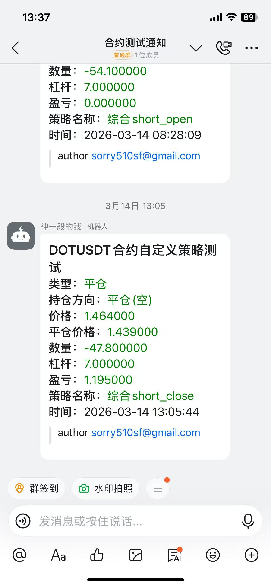
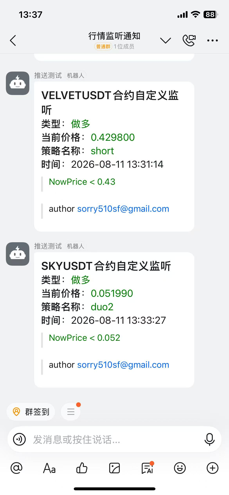
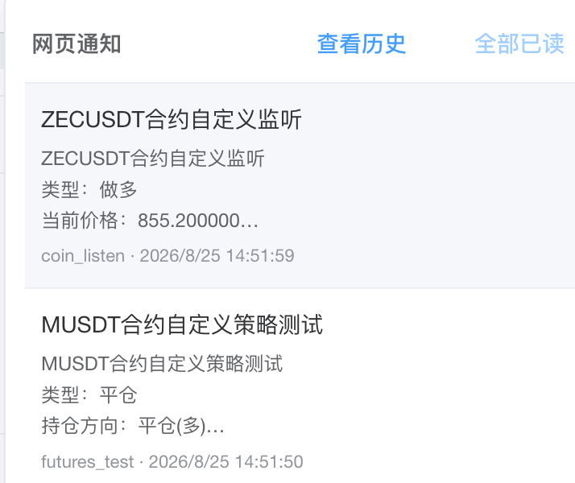

<p align="center">
    <a href="./README.md">简体中文</a>
    ·
    <a href="./README.EN.md">English </a>
</p>

# 币安交易机器人

## 数据库更新（强烈建议使用 MySQL，本项目数据查询较频繁，SQLite 在数据量较大时会有明显延迟）

数据库结构更新已经从正常启动流程中拆分为独立命令。配置好 `conf/app.conf` 的数据库连接后，执行：

```bash
./go_binance_futures sync db
```

该命令会按当前程序版本完成以下操作：

1. 根据已注册的 Model 同步数据库 Schema，创建缺失的表和字段。
2. 全新数据库会初始化 `config`、默认策略模板等基础数据。
3. 根据数据库中的版本号执行 `command/sql/version/*.sql` 版本迁移。
4. 更新数据库版本号并输出同步过程日志。
5. 同步完成后立即退出，不会启动 Web、WebSocket、Scheduler、交易或 Agent 服务。

建议在以下场景执行 `sync db`：

- **首次部署**：配置数据库后，先执行 `./go_binance_futures sync db`，成功后再正常启动程序。
- **升级程序版本**：替换为新版本二进制后，在启动新版本前执行一次 `./go_binance_futures sync db`。
- **恢复或迁移数据库**：复制旧 SQLite 数据库、恢复 MySQL/PostgreSQL 备份或切换数据库后，先执行该命令确认 Schema 和版本迁移完成。
- **日志提示数据库版本过旧或未初始化**：停止服务并执行该命令，成功后再重新启动。

正常运行：

```bash
./go_binance_futures
```

正常启动**不会再自动执行数据库 Schema 或版本迁移**。如果数据库尚未初始化，或数据库版本低于当前二进制要求，程序会提示先运行 `go_binance_futures sync db`。生产环境升级时建议先备份数据库，并在服务停止状态下执行同步命令。

## 功能

## 实时推送
> dingding, slack, 网页 websocket 通知

- 钉钉




- slack


- 网页 websocket 通知


## 自定义交易策略

### ai 生成策略


### 说明
UI 可在 `合约交易 → 策略模板` 中维护技术指标和策略方法，再到 `合约交易 → 合约交易` 为单个币种选择全局策略或自定义策略。

<a href="./STRATEGY.CN.md">自定义详情</a>

# 免责申明
>！！！本项目不构成任何投资建议，投资者应独立决策并自行承担风险！！！

# 功能

## Web UI

访问 `http://<服务器 IP>:<web.port>/zmkm/index.html`，登录后通过左侧菜单进入各功能页。登录账号和密码来自 `conf/app.conf` 的 `web.username`、`web.password`。

| 菜单 | 页面与用途 |
| --- | --- |
| 配置中心 | 管理合约交易、WebSocket、抢新、币种提醒、市场监听、资金费率监听、通知通道、调试推送和外部链接等非 AI 全局配置 |
| AI → 对话 | 统一 Agent 对话入口；选择允许在对话使用的 Native/Portable Skill，可从合约下拉框显式选择 Symbol，避免自然语言币名识别错误 |
| AI → 单币分析 | 从真实合约列表选择 USDT 永续合约，启动结构化 AI 分析并查看历史 TradingPlan、方向、置信度、市场环境和后续价格变化 |
| AI → 模型配置 | 新增、编辑、测试和切换数据库中的 LLM 模型配置；新任务无需重启即可使用当前模型 |
| AI → Skill 管理 | Native / Portable 分 Tab 管理 Skill；支持搜索、分页、启停以及独立的“对话可用”开关 |
| AI → MCP 管理 | 接入和治理第三方 HTTP MCP Server，管理 Tool、Resource、Prompt、OAuth/认证和 Skill 权限 |
| AI → Memory 管理 | 查看和维护 Agent 长期 Memory、Scope、TTL 与状态 |
| AI → 业务 Workflow | 运行市场扫描、策略复盘、策略实验、报警归并和每日市场摘要等业务 Workflow，并查看父任务与子 Agent Task |
| 合约交易 → 受控交易 | 将成功的单币分析转换为 Trade Proposal，经确定性 Risk Engine、人工审批和执行前复检后受控提交 Binance，并保留完整审计 |
| AI → 任务中心 | 查看 Agent 治理、Scheduler、运行指标和 Agent Task 历史 |
| AI → 可观测性 | 查看长期 Trace、模型/Tool/Skill 运行指标、延迟、Token、错误率和变更记录 |
| AI → 报警链路历史 | 查看 FastMove、爆仓等 Signal 从事件、AI 分析/归并到通知或 fallback 的完整链路 |
| AI → AI 配置 | 集中管理 AI 报警、AI Scheduler、Agent 全局预算/治理参数和受控交易 Risk Policy |
| 合约交易 → 合约交易 | 按 `自选`、`USDT`、`USDC` 查看币种；新增、查询、批量编辑、全部开启或全部关闭币种配置 |
| 合约交易 → 合约订单 | 查询真实合约订单，可按币种和时间筛选 |
| 合约交易 → 合约账户 | 查看币安合约资产、持仓和当前挂单 |
| 合约交易 → 本地合约账户 | 查看程序记录的本地资产、持仓和挂单 |
| 合约交易 → 策略模板 | 新增和维护技术指标、策略方法模板 |
| 合约交易 → 测试结果 | 查询实时模拟交易结果，可按币种和时间筛选 |
| 合约交易 → 历史回测 | 使用历史 1m 行情、Funding 与 MarketCondition 回放策略；支持标准 1m 与自适应精度模式，并查看交易、权益曲线、审计事件和高精度下钻统计 |
| 币种提醒 → 现货提醒 / 合约提醒 | 配置到价提醒和可选的自动交易 |
| 市场监听 → 现货监听 / 合约监听 | 配置 K 线、阈值、技术指标和自定义策略监听 |
| 资金费率监听 | 查看资金费率并配置自动交易 |
| 抢新配置 | 配置现货、挖矿币和合约的新币抢购 |
| 系统配置 | 在线编辑 `conf/app.conf`，并提供保存、重启服务和停止服务按钮 |
| 日志 | 查看 `web.commend_log` 命令返回的服务日志 |

### UI 页面截图

截图使用当前UI。涉及账户、订单、配置密钥和日志正文的页面只展示安全区域。

#### 配置中心


#### AI - 单币分析


#### AI - 任务中心


#### AI - Skill 管理


#### AI - 模型配置


#### 合约交易


#### 合约订单


#### 合约账户


#### 本地合约账户


#### 策略模板


#### 测试结果


#### 现货提醒


#### 合约提醒


#### 现货监听


#### 合约监听


#### 资金费率监听


#### 抢新配置


#### 通知配置


#### 系统配置


#### 日志


## AI 功能

### 对话

`AI → 对话` 是统一的人机交互入口。可显式选择允许在对话使用的 Skill；当使用单币分析时，输入框旁可直接从系统真实合约列表选择 Symbol，发送请求时后端优先使用该 Symbol，因此中文币名、别名或其它自然语言不会再导致币种识别错误。未选择 Symbol 时仍可进行普通对话，只有明确的续问语义才会复用上一轮币种。

### 单币分析

从真实 USDT 永续合约列表选择一个 Symbol，并可补充希望 AI 重点判断的方向。系统启动 `symbol_analysis` Skill，读取行情、市场环境和最近一次成功分析，输出结构化 `TradingPlan`。历史列表展示分析状态、方向、置信度、市场环境、当时价格、当前价格、后续涨跌和总结。

### 模型配置

LLM 配置保存在数据库中。页面支持 Provider 模板、自定义 Provider、配置名称、API 地址、API Key、模型名称、请求超时和 Temperature，支持连接测试和切换当前模型。Agent 新任务直接读取当前配置，无需重启服务；API Key 不会由接口回传明文。

### Skill 管理

Skill 注册与治理配置保存在数据库中。Native 与 Portable Skill 分为两个 Tab，支持搜索、分页、新增、编辑、启停、删除，并提供独立的 **对话可用** 开关。`enabled` 控制 Skill 能否运行，`chat_enabled` 只控制是否出现在对话入口，两者互不替代。Portable Skill 的 `allowed-tools` 只是权限申请，不能自行获得高风险或交易权限。

### MCP 管理

系统可以作为 MCP Client 连接第三方标准 HTTP MCP Server，并将远端 Tool、Resource、Prompt 纳入统一 Runtime、Permission、Trace 与 Context。支持连接测试、Catalog 刷新、认证/OAuth 和按 Skill 授权。外部 MCP 中识别出的真实交易能力会被强制归类为高风险交易能力并保持禁用，不能绕过本项目的受控执行链路。

### Memory 管理

长期 Memory 与 Conversation/Task 分离持久化。页面可查看内容、来源、Scope、TTL、状态和更新时间，用于长期上下文维护；Memory 不会获得额外 Tool 或交易权限。

### 业务 Workflow

业务 Workflow 复用现有 Agent Runtime，不创建第二套 Agent。当前包括：

- `market_scan`：确定性 Scanner 先筛选候选，再由 Agent 分析少量币种并输出机会集合。
- `strategy_review`：结合策略模板、已有测试结果、手续费后收益和当前市场环境进行复盘，只提出建议，不直接修改正式模板。
- `strategy_experiment`：Agent 提议候选策略，系统做确定性表达式校验和固定场景测试，再由 Agent 总结；实验结果不会覆盖正式策略。
- `alert_triage`：AI 开启时可把同一币种短时间内的多个相关 Signal 归并为 Incident，降低重复通知；AI 关闭或失败时保持确定性 fallback。
- `daily_market_brief`：聚合市场环境、Scanner 和重要 Signal，生成固定结构的市场摘要；Scheduler 默认关闭。

### 受控交易

受控交易不是“让 LLM 直接下单”。真实执行固定经过：

`成功的 symbol_analysis → Trade Proposal → 确定性 Risk Engine → 人工批准 → 执行前再次 Risk → Execution Service → Binance → Audit`。

- 默认真实 AI 执行关闭，允许交易的 Symbol 白名单默认为空。
- Proposal 只能从成功的结构化单币分析创建；LLM 不决定最终 quantity。
- Risk Engine 检查白名单、方向、当前 MarketCondition 及漂移、价格 freshness、Entry Zone、Stop Loss、滑点、已有仓位/挂单、重复订单、cooldown、杠杆、单笔风险、名义金额、总 Exposure 和 Kill Switch。
- 最终 quantity 根据最大风险、止损距离、最大名义金额和交易对 StepSize 计算。
- 即使已经人工批准，真实执行前仍会重新运行 Risk；Broker 提交前还会再次检查 Kill Switch。
- 使用唯一 `client_order_id` 保证幂等。网络结果不确定时不会自动重复下单，只允许按 `client_order_id` 对账。
- 所有 Proposal、Risk、批准/拒绝、执行和对账动作都会写入审计。
- 当前受控执行提交的是开仓 `MARKET` 订单；TradingPlan 中的止盈/止损用于 Risk 与审批依据，暂不会自动创建 Binance 保护性止盈/止损单。

### AI 配置

所有 AI 相关运行配置集中在 `AI → AI 配置`，包括：

- AI 报警 Pipeline、AI 分析开关、最小严重级别、cooldown、并发与每分钟上限。
- 市场环境自动更新和每日市场摘要 Scheduler。
- Agent 每分钟/每小时启动额度、全局 Token 与 Tool 调用预算。
- 受控交易 Kill Switch、Symbol 白名单、最大单笔风险、最大名义金额、总 Exposure、最大杠杆、价格 freshness、滑点、cooldown 和 Proposal TTL。

这些 AI 配置已从“配置中心”迁出；`配置中心` 只保留非 AI 的交易、行情监听、提醒和系统运行配置。

### 任务中心与可观测性

- **任务中心**：查看 Agent 治理状态、Runtime 直接交易权限与受控执行开关、Scheduler、Task 历史、模型和 Token 等运行信息。
- **可观测性**：查看长期 Trace、各 Skill/模型/Tool 指标、错误率、延迟、Token 和变更记录。
- **报警链路历史**：查看 Signal 从 Event Bus、Signal Engine、AI 分析/归并到 Notification 或 fallback 的完整处理历史。

## 合约交易

`合约交易 → 合约交易` 页面支持每个币种独立配置策略类型、技术指标、策略方法、保证金模式、USDT、杠杆、止盈率、止损率和启用状态。

### 开启方法

1. 在 `配置中心 → 合约交易` 打开合约交易总开关和 `WebSocket`。合约交易总开关切换后直接保存，不再弹出二次确认框。
2. 根据需要打开 `允许做多`、`允许做空`，设置全局策略、持仓限制和下单类型。
3. 进入 `合约交易 → 合约交易`，确认目标币种的参数和 `启用` 状态。

#### 注意事项
1. 目标币种的平仓策略会在配置的 **止盈率(%)** 或 **止损率(%)** 超过之后才会进行
2. 目标币种配置的策略，会覆盖全局策略
3. 目标币种的 USDT 值得时合约的 保证金

### 配置项说明

#### 快速波动通知

快速波动通知可配置阈值、恢复阈值、冷却时间和监控窗口。Signal 的 AI 分析、归并、通知和 fallback 记录可在 `AI → 报警链路历史` 查询。

#### 仓位收益正负转换通知

当某个仓位的收益在正负之间转换时发送通知。仓位或启用币种较多时会增加 API 请求量，请谨慎开启。

#### 允许做多 和 允许做空

这是方向总开关。关闭后，即使策略满足开仓条件，也不会按对应方向自动开仓。

#### 交易策略 和 选币策略

当币种的 `策略类型` 为全局时，使用配置中心选择的交易策略和选币策略；自定义类型使用币种自身配置。

#### 最大持仓数量

自动化持仓达到限制后不再自动开仓，即使策略满足条件。

#### 最大持仓亏损数量

亏损仓位达到限制后不再自动开仓。`自动缩放最大持仓亏损数量` 可根据连续盈亏调整限制。

#### 市场趋势

可手动选择市场趋势，也可打开 `市场趋势自动更新`，供策略判断使用。

#### Ownership 仓位隔离

系统不再提供“排除自动交易的币”配置。真实合约交易由 Ownership 机制隔离：自动策略只管理自己创建并登记为 managed 的仓位和订单；手工仓位、其它 owner 创建的仓位以及来源不明的账户仓位不会被 `auto_strategy` 自动认领、平仓或撤单。

#### 自动下单类型

`LIMIT` 为限价挂单，`MARKET` 为市价单。页面会根据选择显示对应模式。

## 历史回测

`合约交易 → 历史回测` 用于使用历史行情重放策略，与实时 `测试策略` 模拟盘相互独立。回测不会向 Binance 提交真实订单，适合比较策略版本、手续费/滑点/杠杆参数以及不同回放精度下的执行结果。

### 回测模式

- **标准 1m（Standard 1m）**：以 1 分钟 K 线为执行主时间轴，使用历史 K 线、Funding、MarketCondition 和当前策略模板进行确定性回放，速度最快，适合作为基准结果。
- **自适应精度（Adaptive Resolution）**：主时间轴仍然是 1m。只有当 1m 无法确定分钟内真实触发顺序，或 ROI Gate 在分钟内可能成立时，才按需下钻到 `1s`；仍有歧义时再读取逐笔 `trades`。不会把整个历史区间全量转换为秒级或逐笔数据。
- 1m 的 `High/Low` 只用于判断“是否需要下钻”，不会直接当成止盈/止损已经成交。真正的平仓规则会在 1s/trade 时间点重新计算并执行，因此 Adaptive 与 Standard 的交易数量、平仓时间和收益出现差异是正常现象。

### 历史数据与高精度缓存

基础回放数据来自本地历史 K 线、策略需要的技术周期、Funding 和 MarketCondition。页面的“获取历史数据”只预取这些基础数据，高精度数据保持 lazy fetch，只在 Adaptive 真正需要时读取。

高精度数据优先读取数据库中的 sparse cache：

- `market_klines_1s`：只保存实际发生 drill-down 的 1s K 线。
- `market_trades`：只保存实际需要的逐笔成交范围。
- Binance USD-M Futures 的官方 1s archive 在部分日期不可用时，会回退到 Binance Public Data 的 daily trades ZIP，并由已校验的 trades 聚合出目标分钟的 1s K 线。
- 同一份 sparse 数据可以跨 Run 复用。首次 Adaptive Run 可能需要下载和解析较大的 daily trades ZIP；后续相同范围命中数据库 cache 时通常会明显更快。
- 每个 ZIP 会校验 Binance 提供的 SHA256 `.CHECKSUM`。逐笔成交按 `trade_time + trade_id` 排序，避免同毫秒成交顺序不确定。

### 结果、审计与可复现性

回测结果会保存策略版本、起止时间、初始资金、仓位比例、杠杆、手续费、滑点、止盈/止损等输入，并展示净收益、回报率、最大回撤、胜率、Profit Factor、Sharpe、Sortino、手续费、Funding、交易次数、持仓时长和多空分项结果。

Adaptive Run 还会记录：

- 1s drill-down 分钟数、trade drill-down 秒数。
- 1s/trade cache hit、archive cache hit、ZIP 下载次数和下载字节数。
- 每笔交易的 `entry_resolution` / `exit_resolution`（例如 `1m`、`1s`、`trades`）。
- Intrabar Resolution 审计事件和实际消费的高精度 evidence。
- `DataHash` 会合并实际使用的高精度数据证据；Engine/Resolution Model 也会随 Run 保存，便于区分不同实现版本。

页面会实时显示构建数据集、普通回放、读取高精度数据、下载 ZIP、解析 ZIP、保存结果等阶段，并显示本次 Run 已消耗的时间。Trades 和 Audit Events 使用分页加载，长区间回测不会一次性把全部明细塞到浏览器。

### 使用建议

1. 升级程序后先执行 `./go_binance_futures sync db`，确保回测表和 sparse 高精度表已创建。
2. 在 `合约交易 → 历史回测` 选择策略模板、Symbol、时间范围和回放精度，按需要设置初始资金、仓位比例、杠杆、手续费、滑点、止盈和止损。
3. 首次使用较长区间时可先执行“获取历史数据”；若 MarketCondition 历史缺失，可在页面执行对应的回填操作。
4. 需要对比 Standard 与 Adaptive 时，应固定相同的 `start_time`、`end_time`、策略版本和运行参数，避免把时间区间差异误认为精度差异。
5. Adaptive 的第一次运行可能受 Binance Public Data ZIP 下载速度影响；第二次相同范围若 `second_cache_hits` / `trade_cache_hits` 接近 drill-down 数量且 `archive_downloads=0`，说明数据库高精度缓存已经生效。

> 回测是历史模拟，不是交易所撮合引擎的完整复刻。目前不模拟 order-book queue、maker 排队和完整部分成交深度，因此结果不能作为未来收益保证。

## 合约自定义策略的实时模拟盘测试（与历史回测独立）

### 开启方法

在 `配置中心 → 合约交易` 打开 `WebSocket` 和 `测试策略`。模拟交易遵循真实自动交易的策略和限制，但不会操作真实合约账户。结果可通过配置中心的 `查看测试结果` 按钮，或左侧 `合约交易 → 测试结果` 查看。

`测试自动转换次数限制` 非 0 时，连续盈利达到次数后可切换到真实交易；真实交易连续亏损达到次数后切回测试策略。

## 合约订单与账户

- `合约交易 → 合约订单`：查看自动交易订单历史。收益根据下单信息估算，可能与币安实际收益略有差异。
- `合约交易 → 合约账户`：查看币安返回的资产、持仓和当前挂单。
- `合约交易 → 本地合约账户`：查看程序本地记录，可用于对照本地状态与交易所状态。

## 策略模板

在 `合约交易 → 策略模板` 新增或维护模板。模板由技术指标和策略方法组成，可供合约币种和监听策略复用。详细语法请参考 [自定义策略说明](./STRATEGY.CN.md)。

## 新币抢购

- 币币抢买
- 币币挖矿抢卖
- 合约抢买做多
- 合约抢买做空

先在 `配置中心 → 抢新配置` 打开对应总开关，再到左侧 `抢新配置` 页面新增币种规则。

## 币种通知

### 现货通知

- 达到预设价格报警通知
- 自动买入或卖出

### 合约通知

- 达到预设价格报警通知
- 可配置自动交易、保证金模式、USDT、杠杆、止盈价和止损价

先在 `配置中心 → 币种提醒` 打开总开关，再到 `币种提醒 → 现货提醒` 或 `合约提醒` 维护规则。

## 行情监听

### 现货监听

- K 线变化监听
- 可配置阈值、通知间隔和启用状态

### 合约监听

- K 线与技术指标监听
- 自定义策略

先在 `配置中心 → 市场监听` 打开总开关，再到 `市场监听 → 现货监听` 或 `合约监听` 新增规则。

## 资金费率

- 资金费率查询和历史记录
- 资金费率变化监听

先在 `配置中心 → 资金费率监听` 打开总开关，再到左侧 `资金费率监听` 页面查询和配置。

## 系统设置

- `配置中心`：调整保存在数据库中的非 AI 交易、监听、提醒等运行参数和功能开关。
- `AI → AI 配置`：集中调整 AI 报警、Scheduler、Agent 全局预算和受控交易 Risk Policy。
- `系统配置`：在线编辑 `conf/app.conf`。点击 `保存` 后，启动期配置仍需点击 `重启服务` 或手动重启程序才能生效。
- `日志`：查看 `web.commend_log` 配置的命令输出。

`系统配置` 页面包含 API 密钥、数据库密码和通知令牌等敏感信息，请勿截图、复制到 Issue 或提交到 Git。

## 使用注意事项
- 网络必须处于大陆之外(因为币安接口大陆正常无法访问), 已添加币安 api 的代理配置(websocket 因为使用组件问题，暂无代理配置， websocket 只是用于后台更新合约币种最新价格)，如果有可用代理也可以正常使用
- 申请api_key地址: [币安API管理页面](https://www.binance.com/zh/usercenter/settings/api-management)
- 自动交易通过 Ownership 机制管理仓位与订单，只会操作对应 owner 自己创建并登记的 managed 仓位；已有手工仓位和来源不明仓位不会被自动接管
- !!!注意修改app.conf配置后必须重新启动程序，否则配置不会生效!!!
- 请保证账户有足够的 USDT，否则下单会报错
- 钉钉推送 1min 中内不要超过 20 条，否则会被封 ip 一段时间，无法推送成功
- 调整过大的参数(例如同一个 ip 下使用多种组合功能)可能会造成币安 api 请求频率超出限制，会禁用一段时间 ip

## 如何使用
> 在 https://github.com/sorry510/go_binance_futures/releases 页面下载最新对应操作系统的发布版解压后配置运行或者使用`golang`自行编译

### 常见问题（UI）

1. **登录后从哪里开启自动交易？** 进入 `配置中心 → 合约交易`，依次检查合约交易总开关、`WebSocket`、`允许做多/允许做空`；再到 `合约交易 → 合约交易` 检查目标币种是否启用。
2. **在哪里查看模拟交易？** 打开 `配置中心 → 合约交易 → 测试策略`，通过 `查看测试结果` 按钮或 `合约交易 → 测试结果` 查看。
3. **修改配置后为什么没有生效？** 配置中心的运行参数通过页面更新；`系统配置` 编辑的是 `conf/app.conf`，点击 `保存` 后，启动期配置仍需重启程序。
4. **合约页面价格为什么有延迟？** 价格通过 WebSocket 更新，网络或代理不稳定时会延迟。请检查配置中心的 `WebSocket` 状态和网络连接。
5. **账户为什么无法开仓？** 先检查做多/做空开关、最大持仓数、最大亏损仓位数、币种启用状态和账户 USDT；同时检查该 Symbol/方向是否已有 managed 仓位或活动中的受控订单。部分地区 IP 也可能被币安限制。
6. **页面访问很慢怎么办？** 数据量较大时建议使用 MySQL；SQLite 更适合数据量较小的环境。
7. **API 频率限制报错怎么办？** 减少启用币种、监听项和高频通知配置，等待币安限制解除后再恢复。
8. **AI 的报警、Scheduler 和预算在哪里配置？** 统一进入 `AI → AI 配置`；这些设置已经不在配置中心。
9. **AI 会不会直接下真实订单？** 不会。受控交易默认关闭，并且必须经过 Proposal、确定性 Risk、人工批准和执行前复检。
10. **在哪里查看服务日志？** 打开左侧 `日志`；该页面执行 `web.commend_log`，请先在 `conf/app.conf` 中正确配置命令。

### 修改配置文件
> 配置说明请参考 `app.conf.example` 中每一项的说明，复制修改文件名为 `app.conf`

```
cp conf/app.conf.example conf/app.conf
```

#### 历史回测临时 ZIP 目录

Adaptive 回测按需下载 Binance Public Data ZIP。可在 `[binance]` 中配置临时 ZIP 根目录：

```ini
[binance]
public_data_cache_dir = "./cache/tmp"
```

每个 Adaptive Run 会在该目录下创建独立的 `binance-public-data-*` 子目录；Run 正常结束、失败或正常取消后删除本次子目录，但保留 `cache/tmp` 根目录。也可以配置为其它磁盘的绝对路径。

#### 数据库配置

##### 使用 sqlite

- app.conf
```
[database]
driver = "sqlite"
path = "./db/coin.db?_journal_mode=WAL&_busy_timeout=5000"
```

##### 使用 mysql (需要自行安装 mysql，性能更好)

```
[database]
driver = "mysql"
username = ""
password = ""
host= ""
port= ""
dbname = ""
```

### 程序运行
> !!!注意修改app.conf配置后必须重新启动程序，否则配置不会生效!!!

首次部署、升级版本或恢复数据库后，请先执行数据库同步：

```bash
./go_binance_futures sync db
```

同步成功并自动退出后，再正常启动服务：

```bash
./go_binance_futures
```

正常启动不会自动修改数据库结构或执行数据库版本迁移。

### web 界面说明

- 访问地址：`http://<服务器 IP>:<web.port>/zmkm/index.html`
- 本地开发地址：`http://localhost:3333/zmkm/index.html`
- 登录账号和密码：`conf/app.conf` 中的 `web.username`、`web.password`
- 登录后默认进入 `配置中心`，其它功能通过左侧菜单访问；无需手动拼接 `#/...` 路由

### 交易策略
> 参考 `feature/strategy` 文件夹

### UI 常用按钮

- `合约交易 → 合约交易 → 全部开启/全部关闭`：批量修改当前币种列表的启用状态，操作前请确认筛选范围。
- `合约交易 → 合约交易 → 批量编辑`：批量修改币种参数。
- `系统配置 → 保存`：保存页面中的 `conf/app.conf` 内容。
- `系统配置 → 重启服务`：执行 `web.commend_start`，需要在 `conf/app.conf` 中自行配置命令。
- `系统配置 → 停止服务`：执行 `web.commend_stop`，需要在 `conf/app.conf` 中自行配置命令。
- `日志`：执行 `web.commend_log` 并显示输出。

### 新币抢购配置说明

#### 币币抢买功能配置例子

| 币种  |  买卖类型 | 类型  | usdt  | 数量精度  | 开启  |
| ------------ | ------------ | ------------ | ------------ | ------------ | ------------ |
| ABCUSDT(切记带着USDT后缀)   | 买币  | 币币  | 10  |0.1(手动设定会减少一次api请求，不知道时设置为0会在上线时查询接口自动获取)   | 开启   |

#### 币币挖矿抢卖功能配置例子
> ps: 如果挖矿的总价值小于5usdt，不能进行交易

| 币种  |  买卖类型 | 类型  | 数量精度  | 数量 | 开启  |
| ------------ | ------------ | ------------ | ------------ | ------------ | ------------ |
| ABCUSDT(切记带着USDT后缀)   | 卖币  | 币币  | 0.1(手动设定会减少一次api请求，不知道时设置为0会在上线时查询接口自动获取)   | 80(挖矿所得数量) |开启   |

#### 合约抢买做多配置例子

| 币种  |  买卖类型 | 类型  |模式| usdt|  倍率| 数量精度  |  开启  |
| ------------ | ------------ | ------------ | ------------ | ------------ | ------------ |------------ | ------------ |
| ABCUSDT(切记带着USDT后缀)   | 买币  | 合约  | 逐仓或全仓| 10|3 |0.1(手动设定会减少一次api请求，不知道时设置为0会在上线时查询接口自动获取)  |开启   |

#### 合约抢买做空配置例子
| 币种  |  买卖类型 | 类型  |模式| usdt|  倍率| 数量精度  |  开启  |
| ------------ | ------------ | ------------ | ------------ | ------------ | ------------ |------------ | ------------ |
| ABCUSDT(切记带着USDT后缀)   | 卖币  | 合约  | 逐仓或全仓| 10|3 |0.1(手动设定会减少一次api请求，不知道时设置为0会在上线时查询接口自动获取)  |开启   |


## 赞赏

### 二维码


#### bsc-usdt

```
0x170197328b6e73597bc29a1b059f29d4e111e1e8
```

## 交流群

### wx


### tg
https://t.me/+neEHA8VSgF1jMTg9


## 开发
>安装最golang

## 配置文件

```
cp ./conf/app.conf.example app.conf
```

### 安装 bee
> 记得将`GOPATH/bin`添加到环境变量`PATH`，否则 `bee` 命令无法全局使用
> 使用 `go env GOPATH` 查看 `GOPATH` 路径

```
go install github.com/beego/bee/v2@latest
```

### 安装依赖
> 进入项目根目录下执行

```
go mod tidy
```

### 启动
> http://localhost:3333/zmkm/index.html

```
bee run
```

### 打包

#### 打包到`windows`平台
> 其它平台需要参考 bee 文档
> 此项目的 github 的 workflows 实现了 linux amd64 和 window amd64 下的编译打包

```
bee pack -be GOOS=windows
```

## web ui 开发
> https://github.com/sorry510/binance_bot_ui

### TODO

- [X] 完成新币抢购功能
- [X] 完成挖矿新币抛售功能
- [X] 添加独立的币种配置收益率
- [X] 添加一键修改所有币种的配置
- [X] 系统首页显示(那些服务开启和关闭)
- [X] 监听币种的价格突变情况，报警通知
- [X] 学习蜡烛图结合其它数据，报警通知
- [X] 添加新的自动交易策略
- [X] 批量配置自定义策略，使用模板方式导入，增加一个模板页面(可以导入策略模板)
- [X] 更新代码提示功能
- [X] 将配置从 `conf` 缩减，改为可视化配置实时生效
- [X] 数据库更新方式，使用 `go_binance_futures sync db` 独立完成首次建库、Schema 同步和版本迁移，正常启动不自动修改数据库
- [X] 现货和合约添加 tab，添加 usdt 之外的交易对
- [X] 完成统一 Agent 对话、可选 Skill 和合约 Symbol 下拉选择
- [X] 完成 Native / Portable Skill 管理、搜索、分页和对话可用开关
- [X] 完成第三方 HTTP MCP Client、OAuth、Catalog 与权限治理
- [X] 完成长 Memory、业务 Workflow、任务中心和可观测性
- [X] 完成 AI 报警归并与报警链路历史
- [X] 完成 Trade Proposal、确定性 Risk Engine、人工审批和受控真实执行
- [X] 将 AI 运行配置集中迁移到 `AI → AI 配置`
- [X] 抢购添加手动设定价格挂单的功能，不设定才采用市价抢单
- [X] 自动伸缩功能，当连续亏损时，是否需要自动缩减 最大持仓数量，反之亦然，类似于 tcp 窗口缩放
- [ ] api 重构，添加一层适配器用来统一支持其它交易所的接口
- [ ] 替换现有的币安 sdk 换用官方的
- [ ] 添加币本位合约
- [ ] 添加跟单功能
- [ ] 接入币安的订单接口(优点:精确化操控合约的每一次开仓，不再对当前仓位的合约全部平仓, 缺点:手动操作的合约，无法自动根据策略完成平仓)
- [ ] 增加对冲功能，实现空投保值 (现货买入和x倍合约等值对冲)
- [ ] 增加吃资金费率功能(币安有此内置功能)
- [ ] 监控资金流入流出，报警通知
- [ ] 允许同一个仓位多次加仓

### binance 和 x 的新闻驱动

#### 关键词
- 马斯克
- 活动
- 竞赛
- 比赛

#### binance 账号
> https://www.binance.com/zh-CN/square/profile/xxx

- [ ] binance_announcement
- [ ] binance_news
