<p align="center">
    <a href="./README.md">简体中文</a>
    ·
    <a href="./README.EN.md">English </a>
</p>

# 币安交易机器人

## 数据库更新
> 如果是第一次使用程序，配置好数据库之后，直接运行即可(会自动生成相应的数据表)，如果已经使用了一段时间，下载新版本程序后，可以把旧数据库文件(适用于 sqlite 驱动)直接放到 `db` 目录下，然后运行程序即可

## 特色

## 实时推送
> dingding, slack

- 钉钉
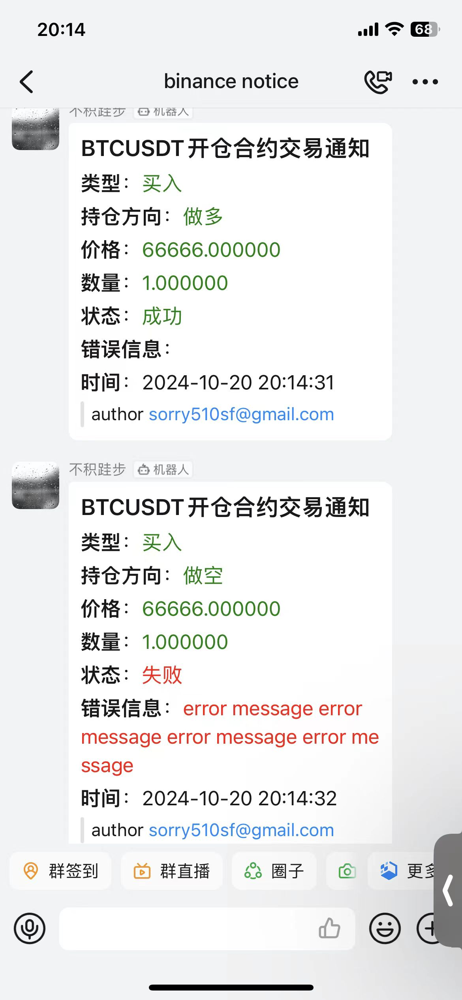

- slack
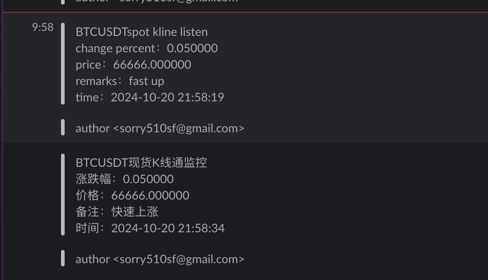

## 自定义交易策略

新版 UI 可在 `合约交易 → 策略模板` 中维护技术指标和策略方法，再到 `合约交易 → 合约交易` 为单个币种选择全局策略或自定义策略。

<a href="./STRATEGY.CN.md">自定义详情</a>

# 免责申明
>！！！本项目不构成任何投资建议，投资者应独立决策并自行承担风险！！！

# 功能

## 新版 Web UI

访问 `http://<服务器 IP>:<web.port>/zmkm/index.html`，登录后通过左侧菜单进入各功能页。登录账号和密码来自 `conf/app.conf` 的 `web.username`、`web.password`。

| 菜单 | 页面与用途 |
| --- | --- |
| 配置中心 | 管理合约交易、WebSocket、抢新、币种提醒、市场监听、资金费率监听、通知通道、调试推送和外部链接等全局开关与参数 |
| 合约交易 → 合约交易 | 按 `自选`、`USDT`、`USDC` 查看币种；新增、查询、批量编辑、全部开启或全部关闭币种配置 |
| 合约交易 → 合约订单 | 查询真实合约订单，可按币种和时间筛选 |
| 合约交易 → 合约账户 | 查看币安合约资产、持仓和当前挂单 |
| 合约交易 → 本地合约账户 | 查看程序记录的本地资产、持仓和挂单 |
| 合约交易 → 策略模板 | 新增和维护技术指标、策略方法模板 |
| 合约交易 → 测试结果 | 查询模拟交易结果，可按币种和时间筛选 |
| 合约交易 → 市场波动日志 | 查询和分组查看快速波动记录 |
| 币种提醒 → 现货提醒 / 合约提醒 | 配置到价提醒和可选的自动交易 |
| 市场监听 → 现货监听 / 合约监听 | 配置 K 线、阈值、技术指标和自定义策略监听 |
| 资金费率监听 | 查看资金费率并配置自动交易 |
| 抢新配置 | 配置现货、挖矿币和合约的新币抢购 |
| 系统配置 | 在线编辑 `conf/app.conf`，并提供保存、重启服务和停止服务按钮 |
| 日志 | 查看 `web.commend_log` 命令返回的服务日志 |

### 新版 UI 页面截图

截图使用当前新版 UI。涉及账户、订单、配置密钥和日志正文的页面只展示安全区域。

#### 登录


#### 配置中心
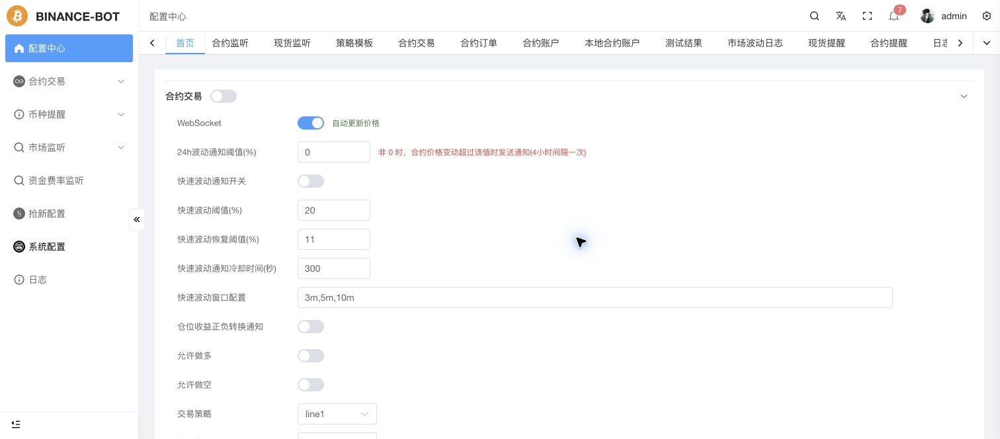

#### 合约交易
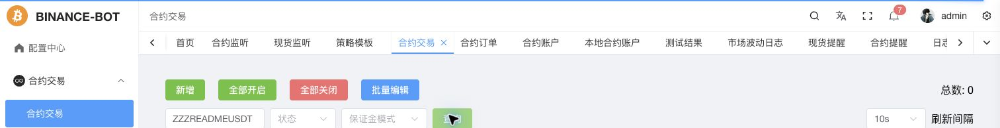

#### 合约订单
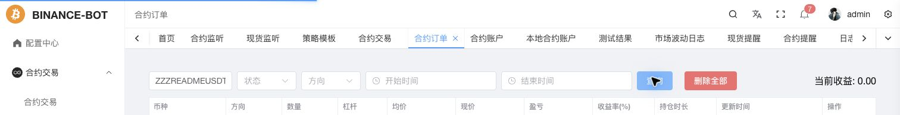

#### 合约账户
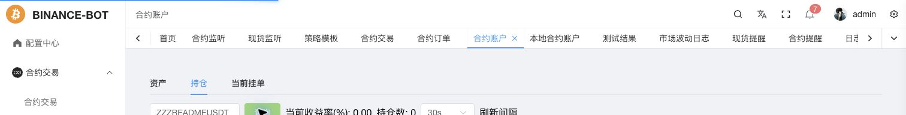

#### 本地合约账户
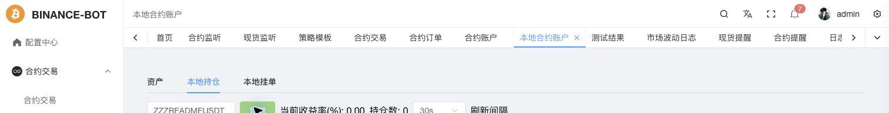

#### 策略模板


#### 测试结果
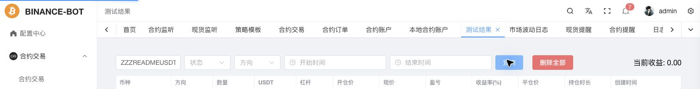

#### 市场波动日志
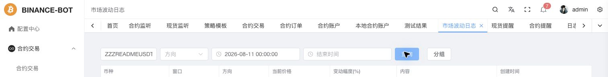

#### 现货提醒
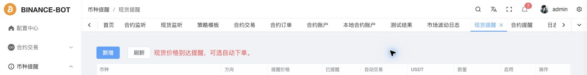

#### 合约提醒
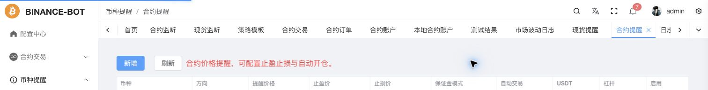

#### 现货监听
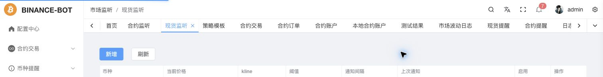

#### 合约监听
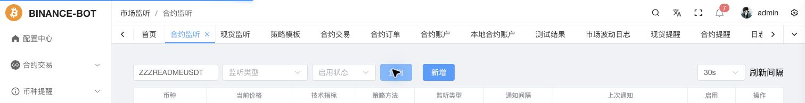

#### 资金费率监听
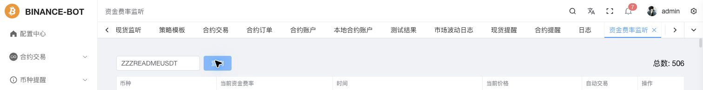

#### 抢新配置
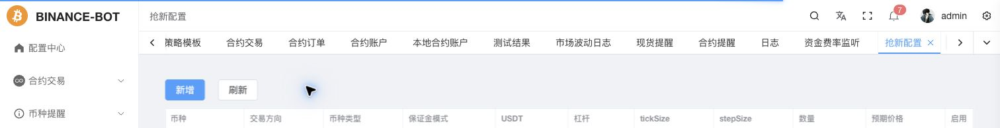

#### 通知配置
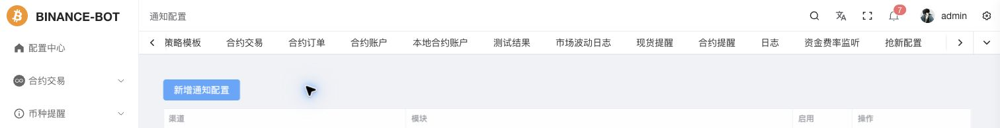

#### 系统配置
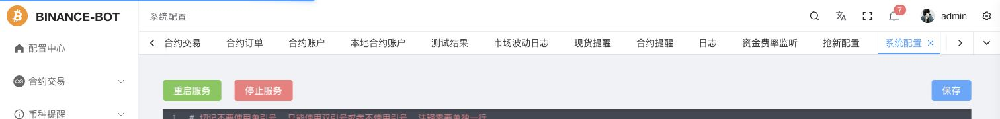

#### 日志
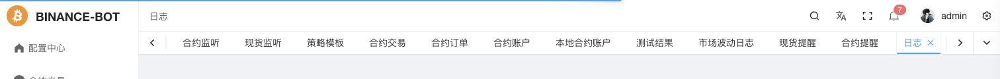

## 合约交易

`合约交易 → 合约交易` 页面支持每个币种独立配置策略类型、技术指标、策略方法、保证金模式、USDT、杠杆、止盈率、止损率和启用状态。

### 开启方法

1. 在 `配置中心 → 合约交易` 打开合约交易总开关和 `WebSocket`。
2. 根据需要打开 `允许做多`、`允许做空`，设置全局策略、持仓限制和下单类型。
3. 进入 `合约交易 → 合约交易`，确认目标币种的参数和 `启用` 状态。

### 配置项说明

#### 价格与快速波动通知

`24h波动通知阈值(%)` 非 0 时会按阈值发送通知；快速波动通知还可配置阈值、恢复阈值、冷却时间和监控窗口。记录可在 `合约交易 → 市场波动日志` 查询。

#### 仓位收益正负转换通知

当某个仓位的收益在正负之间转换时发送通知。仓位或启用币种较多时会增加 API 请求量，请谨慎开启。

#### 允许做多 和 允许做空

这是方向总开关。关闭后，即使策略满足开仓条件，也不会按对应方向自动开仓。

#### 交易策略 和 选币策略

当币种的 `策略类型` 为全局时，使用配置中心选择的交易策略和选币策略；自定义类型使用币种自身配置。

#### 最大持仓数量

自动化持仓达到限制后不再自动开仓，即使策略满足条件。

#### 最大持仓亏损数量

亏损仓位达到限制后不再自动开仓。`自动缩放最大持仓亏损数量` 可根据连续盈亏调整限制。

#### 市场趋势

可手动选择市场趋势，也可打开 `市场趋势自动更新`，供策略判断使用。

#### 排除自动交易的币

在下拉框中选择的币种不会参与自动交易。已有手动仓位但不希望程序自动平仓时，务必加入排除列表。

#### 自动下单类型

`LIMIT` 为限价挂单，`MARKET` 为市价单。页面会根据选择显示对应模式。

## 合约自定义策略的模拟盘测试（无回测功能）

### 开启方法

在 `配置中心 → 合约交易` 打开 `WebSocket` 和 `测试策略`。模拟交易遵循真实自动交易的策略和限制，但不会操作真实合约账户。结果可通过配置中心的 `查看测试结果` 按钮，或左侧 `合约交易 → 测试结果` 查看。

`测试自动转换次数限制` 非 0 时，连续盈利达到次数后可切换到真实交易；真实交易连续亏损达到次数后切回测试策略。

## 合约订单与账户

- `合约交易 → 合约订单`：查看自动交易订单历史。收益根据下单信息估算，可能与币安实际收益略有差异。
- `合约交易 → 合约账户`：查看币安返回的资产、持仓和当前挂单。
- `合约交易 → 本地合约账户`：查看程序本地记录，可用于对照本地状态与交易所状态。

## 策略模板

在 `合约交易 → 策略模板` 新增或维护模板。模板由技术指标和策略方法组成，可供合约币种和监听策略复用。详细语法请参考 [自定义策略说明](./STRATEGY.CN.md)。

## 新币抢购

- 币币抢买
- 币币挖矿抢卖
- 合约抢买做多
- 合约抢买做空

先在 `配置中心 → 抢新配置` 打开对应总开关，再到左侧 `抢新配置` 页面新增币种规则。

## 币种通知

### 现货通知

- 达到预设价格报警通知
- 自动买入或卖出

### 合约通知

- 达到预设价格报警通知
- 可配置自动交易、保证金模式、USDT、杠杆、止盈价和止损价

先在 `配置中心 → 币种提醒` 打开总开关，再到 `币种提醒 → 现货提醒` 或 `合约提醒` 维护规则。

## 行情监听

### 现货监听

- K 线变化监听
- 可配置阈值、通知间隔和启用状态

### 合约监听

- K 线与技术指标监听
- 自定义策略

先在 `配置中心 → 市场监听` 打开总开关，再到 `市场监听 → 现货监听` 或 `合约监听` 新增规则。

## 资金费率

- 资金费率查询和历史记录
- 资金费率变化监听

先在 `配置中心 → 资金费率监听` 打开总开关，再到左侧 `资金费率监听` 页面查询和配置。

## 系统设置

- `配置中心`：调整保存在数据库中的运行参数和功能开关。
- `系统配置`：在线编辑 `conf/app.conf`。点击 `保存` 后，启动期配置仍需点击 `重启服务` 或手动重启程序才能生效。
- `日志`：查看 `web.commend_log` 配置的命令输出。

`系统配置` 页面包含 API 密钥、数据库密码和通知令牌等敏感信息，请勿截图、复制到 Issue 或提交到 Git。

## 使用注意事项
- 网络必须处于大陆之外(因为币安接口大陆正常无法访问), 已添加币安 api 的代理配置(websocket 因为使用组件问题，暂无代理配置， websocket 只是用于后台更新合约币种最新价格)，如果有可用代理也可以正常使用
- 申请api_key地址: [币安API管理页面](https://www.binance.com/zh/usercenter/settings/api-management)
- 如果账号已有合约仓位，请在 `配置中心 → 合约交易 → 排除自动交易的币` 下拉框中选择不希望程序管理的币种，否则程序可能按策略自动平仓
- !!!注意修改app.conf配置后必须重新启动程序，否则配置不会生效!!!
- 请保证账户有足够的 USDT，否则下单会报错
- 钉钉推送 1min 中内不要超过 20 条，否则会被封 ip 一段时间，无法推送成功
- 调整过大的参数(例如同一个 ip 下使用多种组合功能)可能会造成币安 api 请求频率超出限制，会禁用一段时间 ip

## 如何使用
> 在 https://github.com/sorry510/go_binance_futures/releases 页面下载最新对应操作系统的发布版解压后配置运行或者使用`golang`自行编译

### 常见问题（新版 UI）

1. **登录后从哪里开启自动交易？** 进入 `配置中心 → 合约交易`，依次检查合约交易总开关、`WebSocket`、`允许做多/允许做空`；再到 `合约交易 → 合约交易` 检查目标币种是否启用。
2. **在哪里查看模拟交易？** 打开 `配置中心 → 合约交易 → 测试策略`，通过 `查看测试结果` 按钮或 `合约交易 → 测试结果` 查看。
3. **修改配置后为什么没有生效？** 配置中心的运行参数通过页面更新；`系统配置` 编辑的是 `conf/app.conf`，点击 `保存` 后，启动期配置仍需重启程序。
4. **合约页面价格为什么有延迟？** 价格通过 WebSocket 更新，网络或代理不稳定时会延迟。请检查配置中心的 `WebSocket` 状态和网络连接。
5. **账户为什么无法开仓？** 先检查做多/做空开关、最大持仓数、最大亏损仓位数、排除币种、币种启用状态和账户 USDT；部分地区 IP 也可能被币安限制。
6. **页面访问很慢怎么办？** 数据量较大时建议使用 MySQL；SQLite 更适合数据量较小的环境。
7. **API 频率限制报错怎么办？** 减少启用币种、监听项和高频通知配置，等待币安限制解除后再恢复。
8. **在哪里查看服务日志？** 打开左侧 `日志`；该页面执行 `web.commend_log`，请先在 `conf/app.conf` 中正确配置命令。

### 修改配置文件
> 配置说明请参考 `app.conf.example` 中每一项的说明，复制修改文件名为 `app.conf`

```
cp conf/app.conf.example conf/app.conf
```

#### 数据库配置

##### 使用 sqlite

- app.conf
```
[database]
driver = "sqlite"
path = "./db/coin.db?_journal_mode=WAL&_busy_timeout=5000"
```

##### 使用 mysql (需要自行安装 mysql，性能更好)

```
[database]
driver = "mysql"
username = ""
password = ""
host= ""
port= ""
dbname = ""
```

### 程序运行
> !!!注意修改app.conf配置后必须重新启动程序，否则配置不会生效!!!

```
./go_binance_futures
```

### web 界面说明

- 访问地址：`http://<服务器 IP>:<web.port>/zmkm/index.html`
- 本地开发地址：`http://localhost:3333/zmkm/index.html`
- 登录账号和密码：`conf/app.conf` 中的 `web.username`、`web.password`
- 登录后默认进入 `配置中心`，其它功能通过左侧菜单访问；无需手动拼接 `#/...` 路由

### 交易策略
> 参考 `feature/strategy` 文件夹

### 新版 UI 常用按钮

- `合约交易 → 合约交易 → 全部开启/全部关闭`：批量修改当前币种列表的启用状态，操作前请确认筛选范围。
- `合约交易 → 合约交易 → 批量编辑`：批量修改币种参数。
- `系统配置 → 保存`：保存页面中的 `conf/app.conf` 内容。
- `系统配置 → 重启服务`：执行 `web.commend_start`，需要在 `conf/app.conf` 中自行配置命令。
- `系统配置 → 停止服务`：执行 `web.commend_stop`，需要在 `conf/app.conf` 中自行配置命令。
- `日志`：执行 `web.commend_log` 并显示输出。

### 新币抢购配置说明

#### 币币抢买功能配置例子

| 币种  |  买卖类型 | 类型  | usdt  | 数量精度  | 开启  |
| ------------ | ------------ | ------------ | ------------ | ------------ | ------------ |
| ABCUSDT(切记带着USDT后缀)   | 买币  | 币币  | 10  |0.1(手动设定会减少一次api请求，不知道时设置为0会在上线时查询接口自动获取)   | 开启   |

#### 币币挖矿抢卖功能配置例子
> ps: 如果挖矿的总价值小于5usdt，不能进行交易

| 币种  |  买卖类型 | 类型  | 数量精度  | 数量 | 开启  |
| ------------ | ------------ | ------------ | ------------ | ------------ | ------------ |
| ABCUSDT(切记带着USDT后缀)   | 卖币  | 币币  | 0.1(手动设定会减少一次api请求，不知道时设置为0会在上线时查询接口自动获取)   | 80(挖矿所得数量) |开启   |

#### 合约抢买做多配置例子

| 币种  |  买卖类型 | 类型  |模式| usdt|  倍率| 数量精度  |  开启  |
| ------------ | ------------ | ------------ | ------------ | ------------ | ------------ |------------ | ------------ |
| ABCUSDT(切记带着USDT后缀)   | 买币  | 合约  | 逐仓或全仓| 10|3 |0.1(手动设定会减少一次api请求，不知道时设置为0会在上线时查询接口自动获取)  |开启   |

#### 合约抢买做空配置例子
| 币种  |  买卖类型 | 类型  |模式| usdt|  倍率| 数量精度  |  开启  |
| ------------ | ------------ | ------------ | ------------ | ------------ | ------------ |------------ | ------------ |
| ABCUSDT(切记带着USDT后缀)   | 卖币  | 合约  | 逐仓或全仓| 10|3 |0.1(手动设定会减少一次api请求，不知道时设置为0会在上线时查询接口自动获取)  |开启   |


## 赞赏

### 二维码


#### bsc-usdt

```
0x170197328b6e73597bc29a1b059f29d4e111e1e8
```

## 交流群

### wx


### tg
https://t.me/+neEHA8VSgF1jMTg9


## 开发
>安装最新版 golang

## 配置文件

```
cp ./conf/app.conf.example app.conf
```

### 安装 bee
> 记得将`GOPATH/bin`添加到环境变量`PATH`，否则 `bee` 命令无法全局使用
> 使用 `go env GOPATH` 查看 `GOPATH` 路径

```
go install github.com/beego/bee/v2@latest
```

### 安装依赖
> 进入项目根目录下执行

```
go mod tidy
```

### 启动
> http://localhost:3333/zmkm/index.html

```
bee run
```

### 打包

#### 打包到`windows`平台
> 其它平台需要参考 bee 文档
> 此项目的 github 的 workflows 实现了 linux amd64 和 window amd64 下的编译打包

```
bee pack -be GOOS=windows
```

## web ui 开发
> https://github.com/sorry510/binance_bot_ui

### TODO

- [X] 完成新币抢购功能
- [X] 完成挖矿新币抛售功能
- [X] 添加独立的币种配置收益率
- [X] 添加一键修改所有币种的配置
- [X] 系统首页显示(那些服务开启和关闭)
- [X] 监听币种的价格突变情况，报警通知
- [X] 学习蜡烛图结合其它数据，报警通知
- [X] 添加新的自动交易策略
- [X] 批量配置自定义策略，使用模板方式导入，增加一个模板页面(可以导入策略模板)
- [X] 更新代码提示功能
- [X] 将配置从 `conf` 缩减，改为可视化配置实时生效
- [X] 数据库更新方式，第一次自动生成 db 文件，如果存在数据库，就根据版本号进行更新语句更新
- [X] 现货和合约添加 tab，添加 usdt 之外的交易对
- [X] 抢购添加手动设定价格挂单的功能，不设定才采用市价抢单
- [ ] api 重构，添加一层适配器用来统一支持其它交易所的接口
- [ ] 替换现有的币安 sdk 换用官方的
- [ ] 添加币本位合约
- [ ] 接入币安的订单接口(优点:精确化操控合约的每一次开仓，不再对当前仓位的合约全部平仓, 缺点:手动操作的合约，无法自动根据策略完成平仓)
- [ ] 添加定时自动交易(现货买入和x倍合约等值对冲，吃资金费用)
- [ ] 监控资金流入流出，报警通知
- [X] 自动伸缩功能，当连续亏损时，是否需要自动缩减 最大持仓数量，反之亦然，类似于 tcp 窗口缩放
- [ ] 当买入30min中内无明显变化时，及时平仓


### 检查 binance 和 x 的新闻
> https://www.binance.com/zh-CN/square/profile/xxx

#### 关键词
- 马斯克
- 活动
- 竞赛
- 比赛

#### binance 账号
- [ ] binance_announcement
- [ ] binance_news
