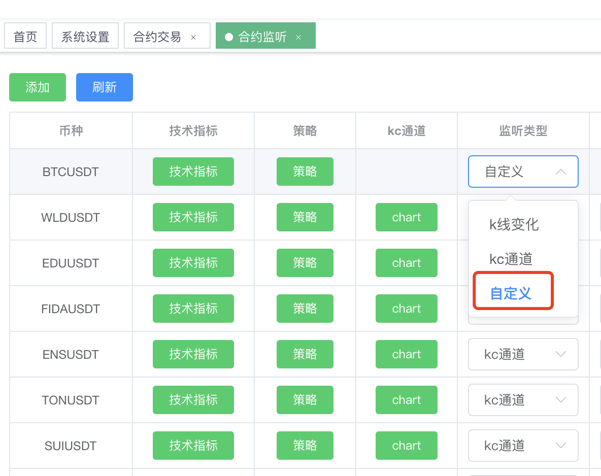
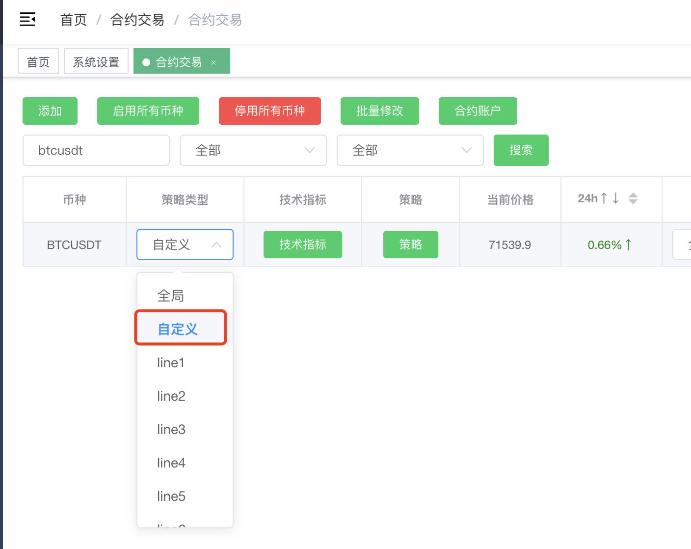
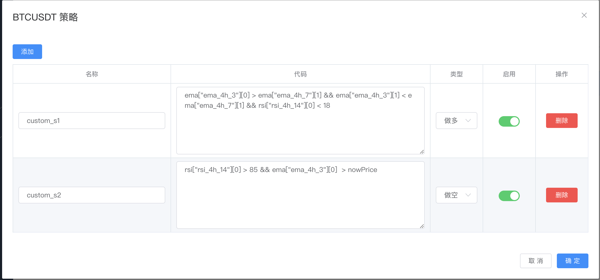
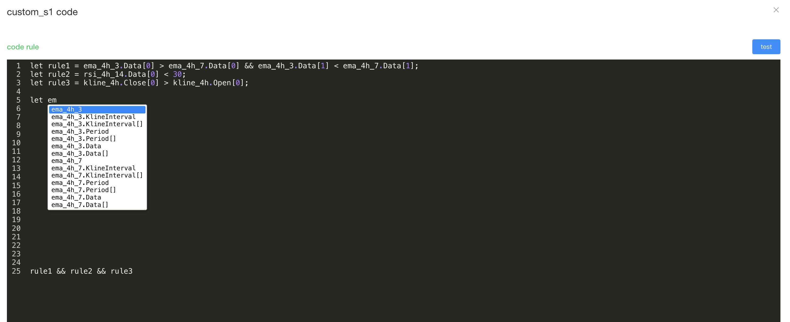

# 如何使用自定义策略
> 项目内置了 `custom-strategy` 的 skill 可以使用 ai 生成想要的策略 json 文件，导入使用

## 首先类型需要选择为自定义




## 然后需要定义技术指标
> 目前支持的指标有 `ma`, `ema`, `macd`, `adx/dmi`, `mfi`, `obv`, `cci`, `roc`, `kdj`, `rsi`, `kc(肯纳特通道)`, `boll(布林带)`, `donchian(唐奇安通道)`, `atr`, `supertrend`

- 示例图


### 名称
> 当前指标起一个名字 `必须所有栏目下唯一`(写策略时需要用到)
> 名称只能包含英文字母、数字和下划线，不能以数字开头，也不能使用系统内置变量名或 `kline_` 前缀。

### k线类型
> k线的周期类型选择

### 其它输入
> 指标相关的标准参数
> 周期必须是正整数且不超过 150；RSI、MFI 和 ROC 需要额外一根 K 线比较前后变化，因此最大周期是 149。OBV 不需要周期。ADX 需要两层 Wilder 初始化，因此最大周期是 75。MACD 要求快线周期小于慢线周期，并且 `慢线周期 + 信号线周期 - 1 <= 150`。KDJ 的 K、D 平滑周期必须是 1 到 150 的整数。KC 和 BOLL 的乘数不能为负数，Supertrend 的 ATR 乘数必须大于 0。

### 启用
> 只有选择了开启的指标才可以在策略中使用

## 最后编写策略
> !!! 策略的逻辑最终必须是 `true` 或 `false` !!!



### 名称
> 策略起一个名字

### 代码
> 自定的策略逻辑, 后面会讲如何编写

### 类型
> 做多 或 做空

### 启用
> 有选择了开启,才会真正使用

## 指标和代码逻辑说明

### ema 指标实例说明
> 假如我们在 ema 的栏目下面定义了 2 行数据如下:


| 名称  |  k线类型 | 周期  | 启用  |
| ------------ | ------------ | ------------ | ------------ |
| ema_4h_3  | 4h  | 4  | true |
| ema_4h_7  | 4h  | 7  | true |

>代表程序会根据`名称`创建 `ema_4h_3` 和 `ema_4h_7` 的变量，具体内容如下:

```
ema_4h_3.KlineInterval // 4h
ema_4h_3.Period // 4
ema_4h_3.Data = [30.2, 30.3, ..] // < 150 count, 分别对应 `ema` 的有效时刻点，排序方式从最新到最旧(ema_4h_3.Data[0] 是当前时刻的 `ema` 数据)

ema_4h_7.KlineInterval // 4h
ema_4h_7.Period // 7
ema_4h_7.Data = [33.2, 35.3, ..]
```

### 策略实例说明
> 根据上面的 `ema` 实例，我们来写一个简单的策略，具体如下

```
ema_4h_3.Data[0] > ema_4h_7.Data[0] && ema_4h_3.Data[1] < ema_4h_7.Data[1]
```

> 我们来解释一下，`ema_4h_3` 是一条 `ema` 的短线，`ema_4h_7` 是一条 ema 的长线(相对于 `ema_4h_3` 来说)，所以上面这个策略的的含义就是前一个时刻的`短线`在`长线`下方，当前时刻的`短线`在`长线`上方, 从术语上来说这是一个金叉，是一个`做多`的趋势策略

### 代码详细说明
> 策略代码编写规范，需要参考 https://expr-lang.org/docs/language-definition#now

#### 支持自动补全功能(Tab)
> 

#### 内置变量

##### NowPrice
###### 类型: float64
###### 含义: 某个币的当前价格

##### SystemStartTime
###### 类型: int
###### 含义: 系统开启的毫秒时间戳

##### NowTIme
###### 类型: int
###### 含义: 当前时间的毫秒时间戳


#### 内置函数
> https://expr-lang.org/docs/language-definition#array-functions

##### 其它函数

###### KdjSimple

```
/**
 * 是否只产生过一次金叉(短线穿越长线一次，没有反复穿越)
 * @param ma1 短线
 * @param ma2 长线
 * @param num 检查数量
 * @returns Boolean
 */
func KdjSimple(ma1 []float64, ma2[]float64, num int) bool
```

> `KdjSimple()` 是两组数组的单次交叉辅助函数；标准 KDJ 指标由后端的 `Kdj()` 计算，并通过技术指标配置中的小写 `kdj` 暴露为 `K`、`D`、`J` 数组。

###### IsDesc

```
// 是否是一个降序数组
func IsDesc(arr []float64) bool
```

###### IsAsc

```
// 是否是一个升序数组
func IsAsc(arr []float64) bool
```

#### 技术指标生成的变量

所有技术指标数组都按“最新到最旧”排序。系统有意保留正在形成的当前 K 线，所以 `Data[0]` 是使用当前 K 线实时计算的指标值，`Data[1]` 才是上一根已经结束的 K 线指标值。

计算口径：

- MA：指定周期的简单移动平均。
- EMA：以第一个完整周期的 SMA 为种子，之后使用 `2 / (period + 1)` 平滑。
- MACD：`DIF = EMA(fast) - EMA(slow)`，`DEA = EMA(DIF, signal)`，`Histogram = DIF - DEA`。
- ADX/DMI：使用 Wilder 平滑计算 `PlusDI`、`MinusDI` 和方向强度 `ADX`；ADX 只衡量趋势强度，方向由两条 DI 的相对位置判断。
- MFI：使用典型价格判断资金流方向，使用 K 线报价资产成交额 `Amount` 作为资金流，结果范围是 0 到 100；价格完全不变或没有正负资金流时返回 50。
- OBV：价格上涨时累加当前 K 线的报价资产成交额 `Amount`，价格下跌时扣减，价格不变时保持不变；系统按当前取得的 150 根 K 线从 0 开始累计，因此应关注方向、斜率和前后变化，而不是跨窗口比较绝对值。
- CCI：使用典型价格相对其周期均值的偏差计算，公式为 `(TypicalPrice - SMA) / (0.015 × MeanDeviation)`；平均偏差为 0 时返回中性值 0。
- ROC：计算当前收盘价相对 `period` 根之前收盘价的百分比变化，公式为 `(Close[当前] - Close[period根前]) / Close[period根前] × 100`；0 表示没有变化。
- KDJ：先计算 RSV，再以初始 `K=50、D=50` 分别按 K、D 平滑周期递推，最后计算 `J = 3 × K - 2 × D`；最高价等于最低价时 RSV 返回 50。
- RSI：使用 Wilder 平滑；完全横盘时返回中性值 50。
- BOLL：中轨使用 SMA，标准差使用总体标准差。
- Donchian：上轨是周期内最高价、下轨是周期内最低价、中轨是上下轨平均值。因为当前 K 线也包含在当前通道中，判断有效突破时通常应将当前价格与上一根通道 `High[1]` 或 `Low[1]` 比较。
- ATR：使用 True Range 和 Wilder 平滑 `1 / period`。
- KC：中轨使用 EMA，上下轨为 `EMA ± multiplier × ATR`。
- Supertrend：以 `HL2 ± multiplier × ATR` 生成基础轨道，再根据前一根收盘价收缩为最终上下轨；`Data` 是当前生效的趋势线，`Trend` 为 `1`（多头）或 `-1`（空头）。

##### ma

| 名称  |  k线类型 | 周期  | 启用  |
| ------------ | ------------ | ------------ | ------------ |
| ma1  | 4h  | 14  | true |


```
ma1.KlineInterval // 4h
ma1.Period // 14
ma1.Data = [30.2, 30.3, ..] // 150 count
```


##### ema

| 名称  |  k线类型 | 周期  | 启用  |
| ------------ | ------------ | ------------ | ------------ |
| ema1  | 4h  | 14  | true |

```
ema1.KlineInterval // 4h
ema1.Period // 14
ema1.Data = [30.2, 30.3, ..] // < 150 count
```

##### macd

| 名称  | k线类型 | 快线周期 | 慢线周期 | 信号线周期 | 启用 |
| ------------ | ------------ | ------------ | ------------ | ------------ | ------------ |
| macd1 | 1h | 12 | 26 | 9 | true |

```
macd1.KlineInterval // 1h
macd1.FastPeriod // 12
macd1.SlowPeriod // 26
macd1.SignalPeriod // 9
macd1.DIF = [0.32, 0.28, ..]
macd1.DEA = [0.25, 0.23, ..]
macd1.Histogram = [0.07, 0.05, ..]
```

例如，实时金叉可以写成：

```
macd1.DIF[0] > macd1.DEA[0] && macd1.DIF[1] <= macd1.DEA[1]
```

##### adx/dmi

| 名称 | k线类型 | 周期 | 启用 |
| ------------ | ------------ | ------------ | ------------ |
| adx1 | 1h | 14 | true |

```
adx1.KlineInterval // 1h
adx1.Period // 14
adx1.ADX = [28.2, 26.8, ..]
adx1.PlusDI = [31.5, 29.1, ..]
adx1.MinusDI = [18.4, 20.2, ..]
```

例如，强势多头和强势空头可以分别写成：

```
adx1.ADX[0] >= 25 && adx1.PlusDI[0] > adx1.MinusDI[0]
adx1.ADX[0] >= 25 && adx1.MinusDI[0] > adx1.PlusDI[0]
```

##### mfi

| 名称 | k线类型 | 周期 | 启用 |
| ------------ | ------------ | ------------ | ------------ |
| mfi1 | 1h | 14 | true |

```
mfi1.KlineInterval // 1h
mfi1.Period // 14
mfi1.Data = [68.2, 64.7, ..]
```

常用参考区间是 20 和 80。例如从超卖区域向上恢复可以写成：

```
mfi1.Data[0] > 20 && mfi1.Data[1] <= 20
```

##### obv

| 名称 | k线类型 | 启用 |
| ------------ | ------------ | ------------ |
| obv1 | 1h | true |

```
obv1.KlineInterval // 1h
obv1.Data = [5823412.5, 5132088.1, ..]
```

OBV 没有周期参数。它使用当前 K 线的报价资产成交额 `Amount` 累加，当前 150 根 K 线窗口中最旧的一根以 0 为基准。因此更适合判断量价是否同步、趋势方向或相邻差值，例如：

```
obv1.Data[0] > obv1.Data[1] && kline_1h.Close[0] > kline_1h.Close[1]
```

##### cci

| 名称 | k线类型 | 周期 | 启用 |
| ------------ | ------------ | ------------ | ------------ |
| cci1 | 1h | 20 | true |

```
cci1.KlineInterval // 1h
cci1.Period // 20
cci1.Data = [125.4, 92.1, ..]
```

CCI 常用参考线是 `+100` 和 `-100`。例如向上突破 `+100` 和向下跌破 `-100` 可以分别写成：

```
cci1.Data[0] > 100 && cci1.Data[1] <= 100
cci1.Data[0] < -100 && cci1.Data[1] >= -100
```

##### roc

| 名称 | k线类型 | 周期 | 启用 |
| ------------ | ------------ | ------------ | ------------ |
| roc1 | 1h | 12 | true |

```
roc1.KlineInterval // 1h
roc1.Period // 12
roc1.Data = [3.25, 2.81, ..] // 百分比
```

例如，ROC 上穿和下穿零轴可以分别写成：

```
roc1.Data[0] > 0 && roc1.Data[1] <= 0
roc1.Data[0] < 0 && roc1.Data[1] >= 0
```

##### kdj

| 名称 | k线类型 | RSV周期 | K平滑周期 | D平滑周期 | 启用 |
| ------------ | ------------ | ------------ | ------------ | ------------ | ------------ |
| kdj1 | 15m | 9 | 3 | 3 | true |

```
kdj1.KlineInterval // 15m
kdj1.Period // 9
kdj1.KPeriod // 3
kdj1.DPeriod // 3
kdj1.K = [62.1, 58.4, ..]
kdj1.D = [55.7, 52.5, ..]
kdj1.J = [74.9, 70.2, ..]
```

例如，低位 K 线上穿 D 线可以写成：

```
kdj1.K[0] > kdj1.D[0] && kdj1.K[1] <= kdj1.D[1] && kdj1.J[0] < 30
```

##### rsi

| 名称  |  k线类型 | 周期  | 启用  |
| ------------ | ------------ | ------------ | ------------ |
| rsi1  | 4h  | 14  | true |

```
rsi1.KlineInterval // 4h
rsi1.Period // 14
rsi1.Data = [67.2, 70.3, ..] //  < 150 count
```

##### kc

| 名称  |  k线类型 | 周期  | 多元  | 启用 |
| ------------ | ------------ | ------------ | ------------ | ------------ |
| kc_1  | 4h  | 50  | 2.75 | true |

```
kc_1.KlineInterval // 4h
kc_1.Period // 50
kc_1.Multiplier // 2.75
kc_1.High = [67.2, 70.3, ..]
kc_1.Mid = [57.2, 50.3, ..]
kc_1.Low = [37.2, 40.3, ..]
```

##### boll

| 名称  |  k线类型 | 周期  | 带宽  | 启用 |
| ------------ | ------------ | ------------ | ------------ | ------------ |
| boll_1  | 4h  | 21  | 2 | true |


```
boll_1.KlineInterval // 4h
boll_1.Period // 21
boll_1.StdDevMultiplier // 2
boll_1.High = [67.2, 70.3, ..]
boll_1.Mid = [57.2, 50.3, ..]
boll_1.Low = [37.2, 40.3, ..]
```

##### donchian

| 名称 | k线类型 | 周期 | 启用 |
| ------------ | ------------ | ------------ | ------------ |
| donchian1 | 1h | 20 | true |

```
donchian1.KlineInterval // 1h
donchian1.Period // 20
donchian1.High = [67.2, 66.8, ..]
donchian1.Mid = [52.2, 51.9, ..]
donchian1.Low = [37.2, 37.0, ..]
```

当前通道包含当前 K 线，因此 `Close[0] > donchian1.High[0]` 通常无法成立。实时判断向上或向下突破时，应与上一根通道比较：

```
kline_1h.Close[0] > donchian1.High[1]
kline_1h.Close[0] < donchian1.Low[1]
```

##### atr

| 名称  |  k线类型 | 周期  | 启用  |
| ------------ | ------------ | ------------ | ------------ |
| atr1  | 4h  | 14  | true |

```
atr1.KlineInterval // 4h
atr1.Period // 14
atr1.Data = [67.2, 70.3, ..] // < 150 count
```

##### supertrend

| 名称 | k线类型 | ATR周期 | ATR乘数 | 启用 |
| ------------ | ------------ | ------------ | ------------ | ------------ |
| supertrend1 | 15m | 10 | 3 | true |

```
supertrend1.KlineInterval // 15m
supertrend1.Period // 10
supertrend1.Multiplier // 3
supertrend1.Data = [105.2, 104.8, ..]
supertrend1.Trend = [1, 1, -1, ..] // 1=多头, -1=空头
```

例如，多头和空头趋势切换可以分别写成：

```
supertrend1.Trend[0] == 1 && supertrend1.Trend[1] == -1
supertrend1.Trend[0] == -1 && supertrend1.Trend[1] == 1
```

#### 其它

##### k 线数据
> 每当你定义了一个任意k线类型的指标时，会额外生成对应的k线数据的变量 `kline_{xx}`

| 名称  |  k线类型 | 周期  | 启用  |
| ------------ | ------------ | ------------ | ------------ |
| xxx  | 4h  | xxx  | true |

```
kline_4h.High = [67.2, 70.3, ..] // 150 count
kline_4h.Low = [27.2, 20.3, ..] // 150 count
kline_4h.Open = [37.2, 30.3, ..] // 150 count
kline_4h.Close = [47.2, 34.3, ..] // 150 count
kline_4h.Amount = [100.1, 100.2..] // 150 count 成交额
kline_4h.Qps = [10.31, 10.32..] // 150 count 每秒成交额
```

##### BTCUSDT 数据

```
BTCUSDT.PercentChange = 1.1 // 涨跌幅
BTCUSDT.Close = 70000.2 // 当前价格
BTCUSDT.Open = 71000.4 // 开盘价
BTCUSDT.Low = 65000.4 // 最低价
BTCUSDT.High = 75000.2 // 最高价
```

##### ETHUSDT 数据

```
ETHUSDT.PercentChange = -1.1 // 涨跌幅
ETHUSDT.Close = 2500.2 // 当前价格
ETHUSDT.Open = 2400.45 // 开盘价
ETHUSDT.Low = 2456.2 // 最低价
ETHUSDT.High = 2840.3 // 最高价
```

##### SOLUSDT data

```
SOLUSDT.PercentChange = -1.1 // 涨跌幅
SOLUSDT.Close = 200.2 // 当前价格
SOLUSDT.Open = 230.45 // 开盘价
SOLUSDT.Low = 143.2 // 最低价
SOLUSDT.High = 244.3 // 最高价
```

##### BNBUSDT data

```
BNBUSDT.PercentChange = -1.1 // 涨跌幅
BNBUSDT.Close = 600.2 // 当前价格
BNBUSDT.Open = 580.45 // 开盘价
BNBUSDT.Low = 578.2 // 最低价
BNBUSDT.High = 640.3 // 最高价
```

##### 所选币种的 数据

```
NowSymbolPercentChange = -1.1 // 涨跌幅
NowSymbolClose = 2500.2 // 当前价格
NowSymbolOpen = 2400.45 // 开盘价
NowSymbolLow = 2456.2 // 最低价
NowSymbolHigh = 2840.3 // 最高价
```

##### 当前仓位的持仓信息

```
ORI = 10.2 // 收益率%
Position.Symbol = "ETHUSDT" // 交易对
Position.EntryPrice = 2500.2 // 持仓价格
Position.MarkPrice = 2400.2 // 当前的标记价格
Position.Amount = 1.2 // 当前的持仓数量，做空是负数
Position.UnrealizedProfit = 32.2 // 当前收益 usdt, 亏损是负数
Position.Leverage = 3 // 杠杆
Position.Side = "LONG" // 合约方向
Position.Mock = false // 是否是 mock 的数据
Position.CreateTime = 1745070856000 // 毫秒时间戳
Position.SourceType = "local" or "api" // 数据来源，只有 local 才有 CreateTime
```

##### 基本趋势涨跌幅
>btc * 0.6 + eth * 0.3 + sol * 0.05 + bnb * 0.05

```
BasicTrend = 0.3
```

##### 市场趋势

> 自动模式下，配置且可用的 LLM 会分析市场快照；LLM 不可用时回退到原有的 1–5 本地加权算法。

```
MarketCondition = "1" // 强多头
MarketCondition = "2" // 偏多头
MarketCondition = "3" // 震荡
MarketCondition = "4" // 偏空头
MarketCondition = "5" // 强空头
MarketCondition = "6" // 多头分化
MarketCondition = "7" // 空头分化
MarketCondition = "8" // 普涨
MarketCondition = "9" // 普跌
MarketCondition = "10" // 高波动震荡
MarketCondition = "11" // 低波动盘整
```
