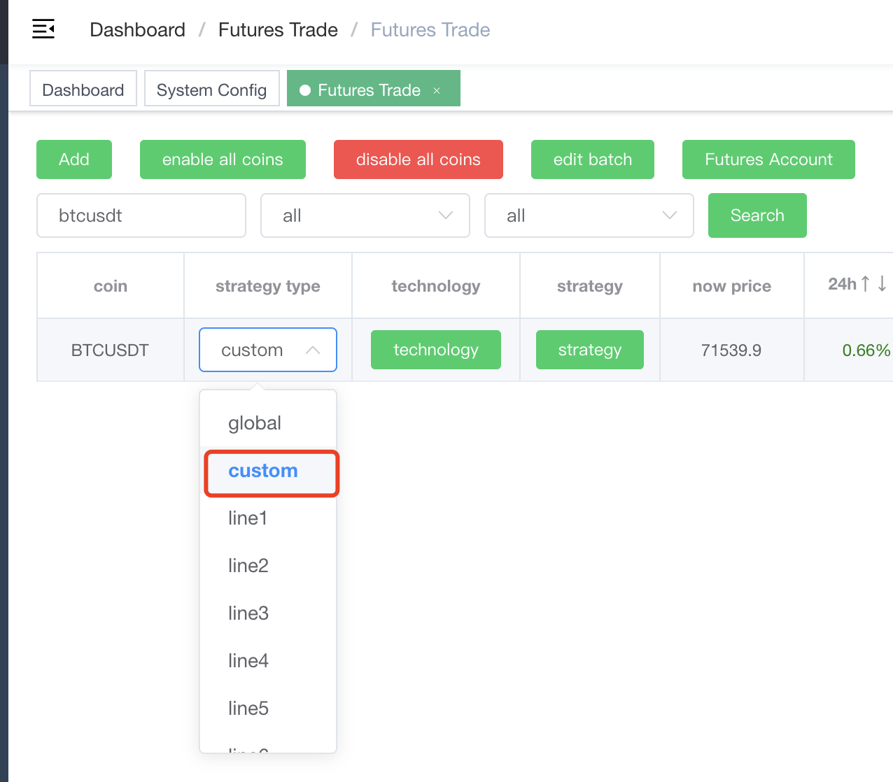
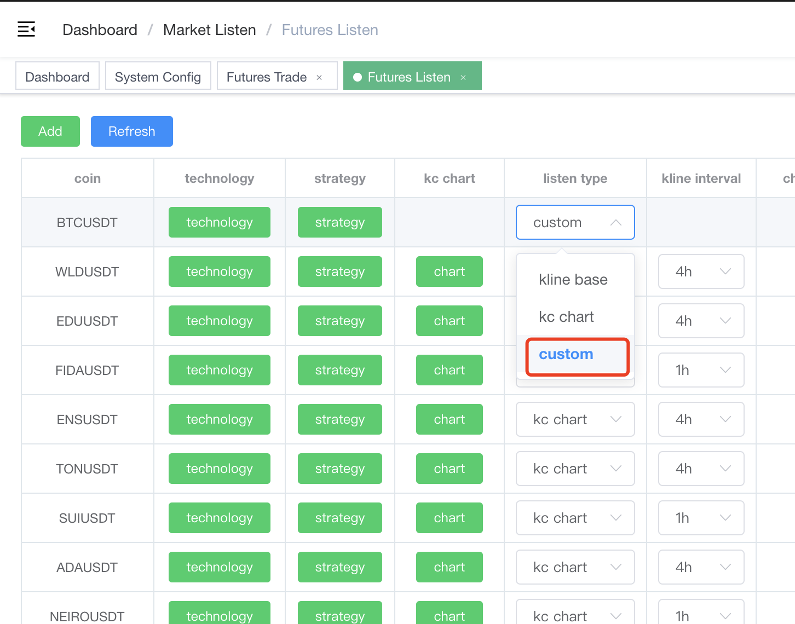
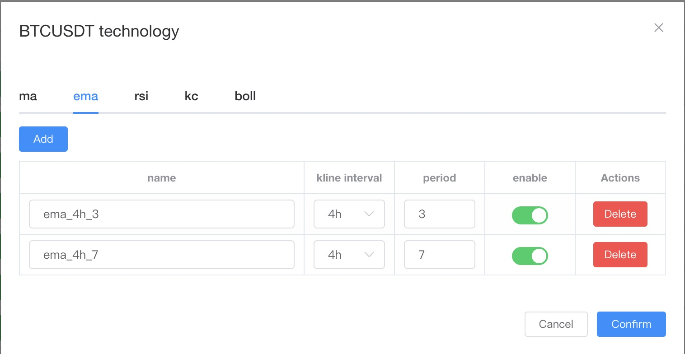
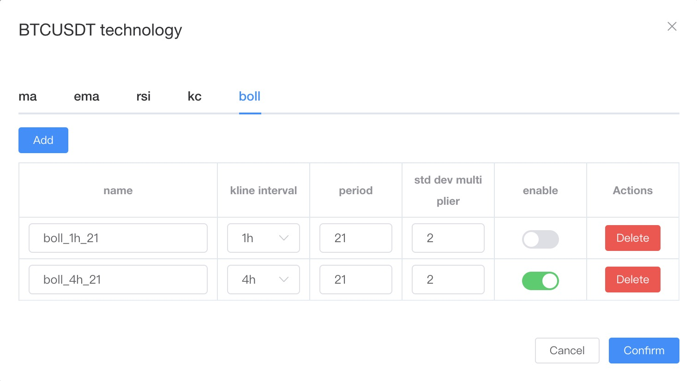
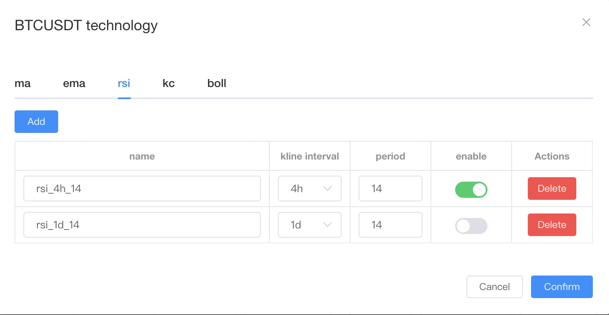
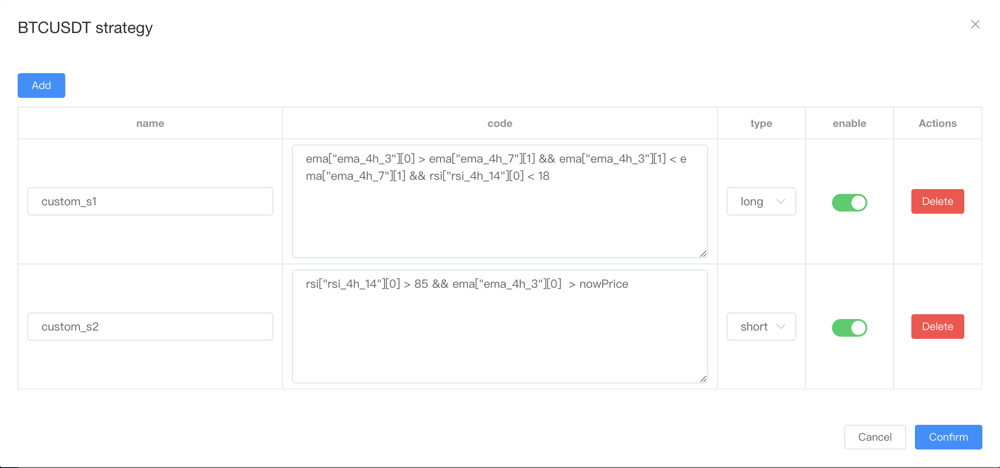
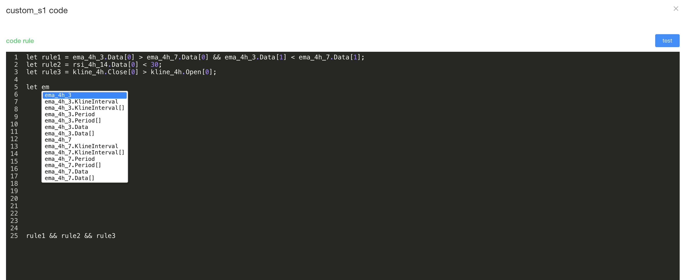

# How to use custom strategy

## Firstly, the type needs to be selected as custom




## Then it is necessary to define technical indicators
> The currently supported indicators are: `ma`, `ema`, `rsi`, `kc(keltner channels)`, `boll`, `atr`

- example




### name
> The name must be unique in a coin (required when writing strategies)

### kline_interval
> kline_interval

### other params
> other params

### enable
> Only indicators that have been enabled can be used in the strategy

## Finally write the strategy
> !!! The logic of strategy must ultimately be `true` 或 `false` !!!

- example


### name
> Give a name to the strategy

### code
> Customize policy logic, we will explain how to write it later

### type
> long or short

### enable
> Only when there is a choice to activate, can it truly be used

## technical indicator and code logic explanation

### ema technology demo
> If we define 2 rows of data under the column of EMA as follows:


| name  |  kline_interval | period  | enable  |
| ------------ | ------------ | ------------ | ------------ |
| ema_4h_3  | 4h  | 4  | true |
| ema_4h_7  | 4h  | 7  | true |

>The program will create 150 element length variables representing `ema_4h_3` and `ema_4h_7`, details:

```
ema_4h_3.KlineInterval // 4h
ema_4h_3.Period // 4
ema_4h_3.Data = [30.2, 30.3, ..] // 150 count, the sorting method is from the latest to the oldest in terms of time dimension (`ema["ema_4h_3"][0]` is the `ema` data at the current time)

ema_4h_7.KlineInterval // 4h
ema_4h_7.Period // 7
ema_4h_7.Data = [33.2, 35.3, ..]
```

### strategy demo
> Based on the `ema` technology demo above, let's write a simple strategy as follows:

```
ema_4h_3.Data[0] > ema_4h_7.Data[0] && ema_4h_3.Data[1] < ema_4h_7.Data[1]
```

>Let's explain that `ema_4h_3` is a short line of `ema`, and `ema_4h_7` is a long line of `ema` (relative to `ema_4h_3`). Therefore, the meaning of the above strategy is that the `short line` at the previous moment is below the `long line`, and the `short line` at the current moment is above the `long line`. In terms of terminology, this is a golden cross and a trend strategy of `long`

### Explanation of all technology indicator examples
> code definition，detail: https://expr-lang.org/docs/language-definition#now

#### auto complete(Tab)
> 

#### Built in variable

##### NowPrice
###### type: float64
###### meaning: the coin of the current price

##### SystemStartTime
###### type: int
###### meaning: the millisecond timestamp of the system start time

##### NowTIme
###### type: int
###### meaning: the millisecond timestamp of the current time

#### Built in function
> https://expr-lang.org/docs/language-definition#array-functions

##### other function

###### Kdj

```
/**
 * Has there only been one golden cross (short-term crossing over long-term once, without repeated crossing)
 * @param ma1 short-term
 * @param ma2 long-term
 * @param num num
 * @returns Boolean
 */
func Kdj(ma1 []float64, ma2[]float64, num int) bool 
```

###### IsDesc

```
// Is it a descending array
func IsDesc(arr []float64) bool
```

###### IsAsc

```
// Is it an ascending array
func IsAsc(arr []float64) bool
```

#### variables generated by technical indicators

##### ma

| name  |  kline_interval | period  | enable  |
| ------------ | ------------ | ------------ | ------------ |
| ma1  | 4h  | 14  | true |


```
ma1.KlineInterval // 4h
ma1.Period // 14
ma1.Data = [30.2, 30.3, ..] // 150 count
```


##### ema

| name  |  kline_interval | period  | enable  |
| ------------ | ------------ | ------------ | ------------ |
| ema1  | 4h  | 14  | true |

```
ema1.KlineInterval // 4h
ema1.Period // 14
ema1.Data = [30.2, 30.3, ..] // 150 count
```

##### rsi

| name  |  kline_interval | period  | enable  |
| ------------ | ------------ | ------------ | ------------ |
| rsi1  | 4h  | 14  | true |

```
rsi1.KlineInterval // 4h
rsi1.Period // 14
rsi1.Data = [67.2, 70.3, ..] //  < 150 count
```

##### kc

| name  |  KlineInterval | Period  | Multiplier  | enable |
| ------------ | ------------ | ------------ | ------------ | ------------ |
| kc_1  | 4h  | 50  | 2.75 | true |

```
kc_1.KlineInterval // 4h
kc_1.Period // 50
kc_1.Multiplier // 2.75
kc_1.High = [67.2, 70.3, ..]
kc_1.Mid = [57.2, 50.3, ..]
kc_1.Low = [37.2, 40.3, ..]
```

##### boll

| name  |  KlineInterval | Period  | StdDevMultiplier  | enable |
| ------------ | ------------ | ------------ | ------------ | ------------ |
| boll_1  | 4h  | 21  | 2 | true |


```
boll_1.KlineInterval // 4h
boll_1.Period // 21
boll_1.StdDevMultiplier // 2
boll_1.High = [67.2, 70.3, ..]
boll_1.Mid = [57.2, 50.3, ..]
boll_1.Low = [37.2, 40.3, ..]
```

##### atr

| name  |  kline_interval | period  | enable  |
| ------------ | ------------ | ------------ | ------------ |
| atr1  | 4h  | 14  | true |

```
atr1.KlineInterval // 4h
atr1.Period // 14
atr1.Data = [67.2, 70.3, ..] // 150 count
```

#### other

##### kline data

> whenever you define an indicator of any kline type, additional variables corresponding to the candlestick data will be generated as `kline_{xx}`

| name  |  kline_interval | period  | enable  |
| ------------ | ------------ | ------------ | ------------ |
| xxx  | 4h  | xxx  | true |

```
kline_4h.High = [67.2, 70.3, ..] // 150 count
kline_4h.Low = [27.2, 20.3, ..] // 150 count
kline_4h.Open = [37.2, 30.3, ..] // 150 count
kline_4h.Close = [47.2, 34.3, ..] // 150 count
kline_4h.Amount = [100.1, 100.2..] // 150 count
kline_4h.Qps = [10.31, 10.32..] // 150 count
```


##### BTCUSDT data

```
BTCUSDT.PercentChange = 1.1
BTCUSDT.Close = 70000.2
BTCUSDT.Open = 71000.4
BTCUSDT.Low = 65000.4
BTCUSDT.High = 75000.2
```

##### ETHUSDT data

```
ETHUSDT.PercentChange = -1.1 // 涨跌幅
ETHUSDT.Close = 2500.2 // 当前价格
ETHUSDT.Open = 2400.45 // 开盘价
ETHUSDT.Low = 2456.2 // 最低价
ETHUSDT.High = 2840.3 // 最高价
```

##### SOLUSDT data

```
SOLUSDT.PercentChange = -1.1
SOLUSDT.Close = 200.2
SOLUSDT.Open = 230.45
SOLUSDT.Low = 143.2
SOLUSDT.High = 244.3
```

##### BNBUSDT data

```
BNBUSDT.PercentChange = -1.1
BNBUSDT.Close = 600.2
BNBUSDT.Open = 580.45
BNBUSDT.Low = 578.2
BNBUSDT.High = 640.3
```

##### now symbol data

```
NowSymbolPercentChange = -1.1
NowSymbolClose = 2500.2
NowSymbolOpen = 2400.45
NowSymbolLow = 2456.2
NowSymbolHigh = 2840.3
```

##### symbol position
> string -> float: float(Position.xxx)

```
ORI = 10.2 // profit %
Position.Symbol = "ETHUSDT"
Position.EntryPrice = 2500.2 
Position.MarkPrice = 2400.2
Position.Amount = 1.2
Position.UnrealizedProfit = 32.2 
Position.Leverage = 3
Position.Side = "LONG"
Position.Mock = false // is mock data
```

##### basic trend(change percent)
>btc * 0.6 + eth * 0.3 + sol * 0.05 + bnb * 0.05

```
BasicTrend = 0.3
```