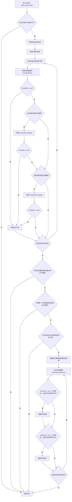
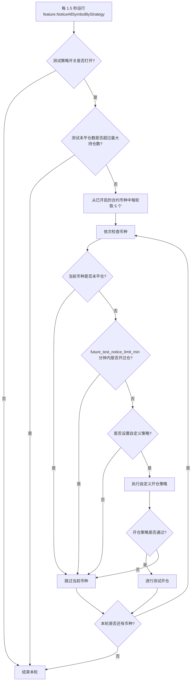
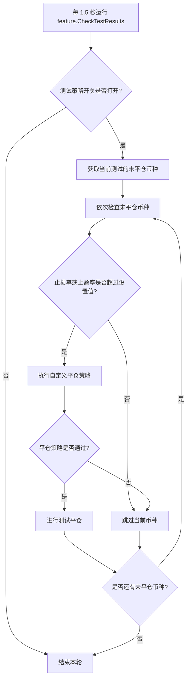

## 自动交易流程

1. 每2秒运行一次 feature.StartTrade
2. 如果 合约交易 开关打开了，才继续进行下面步骤
3. 获取当前自动挂单的订单，如果超时了，就取消挂单
4. 依次检查当前持仓币种，循环进行如下的尝试平仓操作
4.1. 根据所用策略中的 AutoStopOrder 方法，如果返回 Complete = true 则完成对应平仓(目前自定义策略永远返回 false)
4.2. 检查当前币种设置的 止损率(%)，如果超过时，则使用所用策略中的 AutoStopOrder 方法 CanOrderComplete 方法，如果返回 Complete = true 则完成对应平仓
4.3. 检查当前币种设置的 止盈率(%)，如果超过时，则使用所用策略中的 AutoStopOrder 方法 CanOrderComplete 方法，如果返回 Complete = true 则完成对应平仓
5. 检查当前已亏损的仓位数量，如果超过系统设置的 最大持仓亏损 数量，就停止下面步骤，否则继续
6. 检查当前挂单+当前仓位数量，如果超过系统设置的 最大持仓数 数量，就停止下面步骤，否则继续
7. 检查如果系统设置同时关闭了 允许做多 和 允许做空，就停止下面步骤，否则继续
8. 根据选币策略，循环进行如下的尝试开单操作
8.1. 根据所用策略中的 GetCanLongOrShort 方法，返回 CanLong 和 CanFalse
8.2. 当前币种 CanLong = true, 系统设置 允许做多，且当前没有对应的 多仓挂单 和 多仓仓位，就进行开多挂单
8.3. 当前币种 CanShort = true, 系统设置 允许做空，且当前没有对应的 空仓挂单 和 空仓仓位，就进行开空挂单

## 自动测试交易流程

### 开仓流程
1. 每1.5秒运行一次 feature.NoticeAllSymbolByStrategy
2. 如果 测试策略 开关打开了，才继续进行下面步骤
3. 检查当前测试的未平仓数量, 如果超过系统设置的 最大持仓数 数量，就停止下面步骤，否则继续
4. 依次检查当前合约列表开启的所有币种(每轮5个), 循环进行如下的测试开仓操作
4.1. 处于未平仓的币种跳过
4.2. future_test_notice_limit_min(默认 5) 分钟之内，开过仓币种的跳过
4.3. 没有设置自定义策略的币种跳过
4.4. 执行自定义开仓策略通过的币种，进行测试开仓

### 平仓流程
1. 每1.5秒运行一次 feature.CheckTestResults
2. 如果 测试策略 开关打开了，才继续进行下面步骤
3. 依次当前测试的未平仓币种，循环进行如下的测试平仓操作
3.1. 检查当前币种设置的 止损率(%)和止盈率(%)，如果都没有超过，就停止如下操作，否则继续
3.2. 执行自定义的平仓策略通过的币种，就行测试平仓

## 流程图

### 自动交易流程图

### 自动测试开仓流程图

### 自动测试平仓流程图

